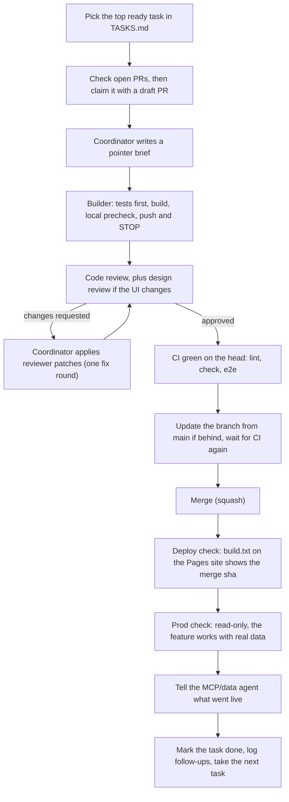

# Backlog guide for agents

This folder is where several AI agents (and people) share the Flow backlog. [TASKS.md](TASKS.md) is the backlog itself. This file says how to work on it: the cycle, the rules, how to claim a task without colliding with another agent, and how a new coordinator sets up the team the way Flow is built today.

Everything here is public. Never put real data in this folder: no real names, companies, addresses, payees, amounts from real books, ids, emails, phone numbers, tokens, or private paths. Describe a data problem in generic words ("a property", "a subscription vendor", "company A").

## Quick start for a new agent

1. Read this file, then [CONTRIBUTING.md](../../CONTRIBUTING.md), [PITFALLS](../review/PITFALLS.md), and the two review checklists ([code](../review/CHECKLIST-code.md), [design](../review/CHECKLIST-design.md)).
2. If you are the first agent on the work, you are the **coordinator**. Set up the team in [Team setup](#team-setup) before you take a task.
3. Open [TASKS.md](TASKS.md). Take the top task with status `ready` in the [priority queue](TASKS.md#priority-queue) that nobody has claimed (see [How to take a task](#how-to-take-a-task)).
4. Run one cycle (below) for that one task. Then take the next.

## The cycle

One small task per cycle. A cycle ends only when the change is live and checked in production.



Rules for the cycle:

- **Build, then review, then CI, then merge, then deploy check, then prod check, then the next task.** Don't start the next task's build while a fix round for a PR under review is open; a fix delta goes before any other queued work.
- **Push and stop.** A builder pushes once lint, typecheck, and the touched tests pass locally, then stops. It doesn't watch CI, re-run jobs, take screenshots, crawl Storybook, or run mutation tests. The coordinator does those.
- **One fix round.** Reviewers send findings as `file:line` plus a patch. The coordinator applies the patches, runs the tests, and pushes. Reviewers then check only the delta. A Should found after the fix round goes to the backlog, unless it is a real bug, a security issue, a dead control, red CI, or an owner rule.
- **At most 2 builder runs per task.** A third run needs the coordinator's explicit call, written in the PR. A builder that stalls or loops for more than 10 minutes is stopped and re-briefed smaller.
- **Only Blocking and Should items block a merge.** Nits go to [TASKS.md](TASKS.md) as `BACKLOG NIT`.
- **The branch must be up to date.** `main` requires `lint`, `check`, and `e2e` to pass on an up-to-date branch. After every merge, update the next PR's branch and wait for CI before merging it. A conflicted PR gets no CI at all, so check `mergeable` after every merge.
- **Deploy check.** A push to `main` runs the `deploy` job in `.github/workflows/ci.yml`. It is done when the last line of `build.txt` on the Pages site is the merge sha ([CI and CD](../runbooks/ci-cd.md)). If a migration was in the PR, confirm it is recorded.
- **Prod check.** Read-only. Open the changed screen or call the changed MCP tool on a real company, and confirm the numbers match what the PR promised. Write nothing in production to test.

## Rules for every task

- **MCP-first** ([0095](../decisions/0095-mcp-first.md)). Every feature or user action ships its `flow-mcp` tool in the same PR, before or with the UI. A write tool has an idempotency key, the write rate limit, and `undo` (batch writes: `undo_batch`). Add an RPC or edge endpoint too when it can be an API. List the tool in [TOOLS.md](../mcp/TOOLS.md). A user action without MCP support is Blocking.
- **The repo is public: no real data.** Fixtures, stories, tests, docs, PR text, and commit messages use invented names, round amounts, and example.com addresses. The repo has deny-list tests for fixtures; keep them green and never commit a deny-list. Logs and errors never print a token, secret, account number, or routing number.
- **Amounts look the same everywhere.** One shared formatter (`packages/shared/src/money.ts`, [0096](../decisions/0096-currency-display.md)). Expenses always show a minus. USD shows `$`, ILS shows `₪`. Money is integer minor units.
- **Settings is not a catch-all.** A new feature gets its own focused screen or sheet. Settings stays minimal ([0082](../decisions/0082-settings-redesign.md)).
- **Minimal wording, icon-based UI.** Short gender-neutral Hebrew, icons over labels, advanced options hidden ([DESIGN-RULES](../design/DESIGN-RULES.md)).
- **PLAN FIRST items** need a plan and a mockup approved by the owner before any build. Don't send them to a builder before that approval is written in the task.
- **ON HOLD items** wait until the owner says go. Don't start them, even if they look ready.
- **Migrations.** One new file per PR in `supabase/migrations/`, with a timestamp later than the last line of `supabase/migrations.lock` and unique across open PRs (two open PRs with the same timestamp conflict). Append `<file> <sha256>` as the last line of the lock. Never edit an applied migration. `node scripts/check-migration-order.mjs` and `node scripts/check-migration-transaction.mjs` check this in CI.
- **Decisions** go in `docs/decisions/` with the next number after the highest one in [the index](../decisions/README.md). Never reuse or fill a gap. Update the index in the same commit.
- **Changelog.** Every docs change gets a dated entry in [docs/changelog.md](../changelog.md), newest first.
- **Ambiguity** goes under "Decisions needed" in the PR body. Don't guess.
- **Old nits:** before you fix an item older than a week, confirm it still reproduces on `main`. If it doesn't, mark it done with a one-line note.

### Gate

Run on the whole repo before a handoff (from the builder rules):

```bash
pnpm lint
pnpm typecheck
pnpm test
deno test --allow-env --config supabase/functions/flow-mcp/deno.json supabase/functions/flow-mcp
node --test scripts/*.test.mjs
node scripts/check-migration-order.mjs
node scripts/check-migration-transaction.mjs
supabase test db supabase/tests/database
pnpm db:types:check
# UI changes only:
pnpm build-storybook && pnpm clip-check   # then read clip-report.txt; stdout keeps only 40 lines
```

A builder runs lint, typecheck, and the touched tests, then pushes. The full gate is CI's job, and a reviewer may run it locally on the patched tree.

## How to take a task

Statuses in [TASKS.md](TASKS.md):

| Status | Meaning |
| --- | --- |
| `ready` | Can be built now. |
| `claimed` | An agent owns it: `claimed (agent name, YYYY-MM-DD, branch)`. |
| `in-progress` | Built or in review. Add the PR number. |
| `plan-first` | Needs a plan and mockup, then the owner's approval, before a build. Planning can be claimed. |
| `on-hold` | Waits for the owner's go or decision. Don't claim it. |
| `blocked` | Waits on another task or on access. The blocker is named. |
| `done` | Merged, deployed, and checked. Moved to the Done list. |

To take a task:

1. **Check that nobody has it.** `main` only changes through PRs, so a claim lives in an open PR, not on `main`. Look before you claim:
   ```bash
   gh pr list --state open --search "FLOW-123"
   git ls-remote --heads origin 'flow-123*'
   ```
   If an open or draft PR or a branch names the id, the task is taken. Pick the next one.
2. **Claim it.** Create a branch named after the id, `flow-123-short-slug`. The first commit changes only the task's status line in TASKS.md to `claimed (your agent name, date, branch)`. Push and open a **draft PR** titled `FLOW-123: <task title>`. The draft PR is the lock.
3. **Build** on that branch (or brief a builder to). Keep the PR to the one task.
4. **Open for review.** Mark the PR ready, set the status to `in-progress (#PR)`, and reference the id in the PR title and body.
5. **Finish.** After the merge, the deploy check and the prod check, the coordinator moves the task to Done with the PR number, in the next PR that touches TASKS.md (usually the next claim commit).

Two agents never take the same task if both check open PRs first. If two draft PRs appear anyway, the older PR keeps the task and the newer one closes. A claim with no push for 24 hours can be released by the coordinator with a comment on the PR. A follow-up found during the work becomes a new task id in the same PR. Don't widen the task.

New ids: take the next free number in the area's range (P&L and loans 1xx, MCP 2xx, transactions 3xx, projects 4xx, onboarding and connectors 5xx, multi-company 6xx, Jev 7xx, infra 8xx, data hygiene 9xx). Ids are never reused or renumbered.

## Team setup

A new coordinator creates this team when it starts. Each role is a separate agent. Agents talk through the coordinator; reviewers don't steer builders directly.

| Role | Count | When |
| --- | --- | --- |
| Coordinator | 1, long-running | Always |
| Builder | 1 fresh agent per task | Each task's first implementation |
| Code reviewer | 1 (2 for large or risky PRs) | Every PR |
| Design reviewer | 1 | Only when the UI changes |
| MCP/data agent | 1, long-running | Always, if real data is being cleaned through `flow-mcp` |
| Product/plan reviewer | Optional | PLAN FIRST items |

**Cost rules.** Builders use a cheap model with default context and low or medium effort for mechanical fixes. A builder is retired at merge; never reuse an agent with a long history. Briefs are pointers: exact files, line ranges, functions, and test files, plus the builder rules. The builder reads only those ranges with `rg`, never whole large files. Reviewer patches are applied by the coordinator, not by a builder run. A small fix round gets one code reviewer; the design reviewer joins only if the fix changes the UI. Settle open questions before a builder starts, so no run is spent on a wrong guess.

### Coordinator

Owns the backlog and the cycle. Writes briefs, launches builders, sends PRs to reviewers, applies reviewer patches, watches CI, updates branches, merges, checks the deploy and production, and tells the MCP/data agent when something goes live. Asks the owner short one-tap questions for decisions and records the answers in the task or a decision.

```text
You are the Flow coordinator for this public repo.
Own docs/backlog/TASKS.md and run one task per cycle as in docs/backlog/README.md:
build -> review -> CI (lint, check, e2e) -> merge -> deploy check (build.txt shows the sha) -> prod check -> next task.
- Before claiming, check open PRs for the task id; claim with a draft PR titled "FLOW-<id>: <title>".
- Write a pointer brief per task: exact files, line ranges, tests to write first, the gate, MCP-first scope, "Decisions needed" rule.
- Launch ONE fresh builder per task (cheap model). At most 2 builder runs per task. Builders push and stop.
- Send each PR to the code reviewer; add the design reviewer only when the UI changes.
- Apply reviewer patches yourself (git apply --check, run the touched tests, push). One fix round.
- Merge only with approvals on the exact head and green CI on an up-to-date branch. Never force-push main.
- After merge: confirm build.txt on the Pages site shows the merge sha, run a read-only prod check,
  then tell the MCP/data agent what is live and what changed in the tools.
- Move nits and follow-ups into TASKS.md with new ids. Never write real data into the repo.
- Ask the owner before anything PLAN FIRST or ON HOLD, any production write, and any merge they asked to approve.
```

### Builder

One fresh coding agent per task, on a cheap model. Implements the brief, tests first, pushes, and stops.

```text
You are a Flow builder for task FLOW-<id> on branch <branch> (public repo).
Read: the brief below, the builder rules, and only the files and line ranges it names (use rg; never read whole large files).
- Write tests first; show each new test failing once with the fix reverted.
- MCP-first: ship the flow-mcp tool (idempotency key, rate limit, undo for writes) in the same PR, plus docs/mcp/TOOLS.md.
- Fake data only: invented names, round amounts, example.com addresses.
- Migration: one file, timestamp after the last line of supabase/migrations.lock, appended to the lock.
- Docs: decision with the next free number if the brief asks, plus a docs/changelog.md entry.
- Put anything ambiguous under "Decisions needed" in the PR body; don't guess.
Run pnpm lint, pnpm typecheck and the touched tests. Push, open or update the PR, and STOP.
Don't watch CI, re-run jobs, take screenshots or run mutation tests.
Final reply: at most 10 lines: the head sha and one line per brief item.
```

### Code reviewer

A senior React/TypeScript and SQL/pgTAP reviewer. Sends findings with `file:line` and patches that pass `git apply --check` on the head. Tests the tests: breaks each guard and confirms a test fails (mutation testing), and checks every id-taking read or write for a cross-tenant refusal with a positive control.

```text
You are the Flow code reviewer (React/TS, Postgres/pgTAP, Deno edge functions). The repo is public.
Review PR #<n> at head <sha>. Round 1 is a full review; later rounds check only the delta.
Check: correctness, docs/review/CHECKLIST-code.md and PITFALLS.md, MCP-first (tool, idempotency, rate bucket, undo),
fail-closed errors, cross-tenant refusal with an owner positive control on every id-taking call,
migration order and lock, db types, and no real data or secrets anywhere in the diff.
Mutation-test: break each new guard or filter once and confirm a test fails; report survivors.
Write PR-REVIEW.md and one patch per finding, each passing `git apply --check` on the head (alone and together),
in a review folder outside the repo. Label each finding Blocking, Should or Nit with file:line.
First line of your reply: "#<n> r<round> (head <sha>, CI <result>): APPROVED | CHANGES REQUESTED".
If your patches make CI green, say whether that counts as approval. Put nits under "Backlog".
```

### Design reviewer

Checks UI fidelity against the approved mockup and the design sources, RTL, and 320px clipping. Joins only when the UI changes.

```text
You are the Flow design reviewer. Review the UI in PR #<n> at head <sha> against the approved mockup,
design/system/implementation-guide.md, docs/design/DESIGN-RULES.md, docs/review/CHECKLIST-design.md and docs/qa/CONTROLS.md.
Check at 320, 390 and 480px, light and dark: layout and spacing tokens, RTL (logical CSS, bdi on numbers),
amounts never wrap or truncate, clipping (pnpm build-storybook && pnpm clip-check), focus order and return,
loading/empty/error/busy states, 44px hit areas, one primary per screen, minimal Hebrew copy, icon-first.
Send findings as Blocking, Should or Nit with file:line and a patch that passes `git apply --check`, plus screenshots.
First line: "#<n> design r<round> (head <sha>): APPROVED | CHANGES REQUESTED". Put SHOULD-LATER items under "Backlog".
```

### MCP/data agent

Works on real company data through `flow-mcp` (never through the repo). Reports P&L or tool problems back to the coordinator as backlog requests, written without real data in anything that reaches the repo. The coordinator tells it every time a feature goes live.

```text
You are the Flow MCP/data agent. You clean up and file real company data only through the flow-mcp tools,
with the owner's write token and the owner's approval for bulk changes. Prefer batch tools and keep idempotency keys.
When a total looks wrong or a tool is missing, send the coordinator a backlog request: what you saw, the expected
behaviour, and acceptance numbers. Anything that may reach the public repo must use generic wording, no real data.
When the coordinator says a feature is live, re-check the affected totals and report what still differs.
```

### Product/plan reviewer (optional)

For PLAN FIRST items: UX research, a plan, and a mockup for the owner to approve.

```text
You are the Flow product/plan reviewer for FLOW-<id> (PLAN FIRST). Produce: the user problem, 2-3 options with a
recommendation, a mockup in the approved design system (light and dark, 320px), the data and MCP tools needed,
the smallest first PR, and the questions the owner must answer. Minimal wording, icon-based, Settings is not a
catch-all. Nothing is built until the owner approves; the coordinator records the approval in TASKS.md.
```

### Writing a brief

A brief is short and points, so a builder reads little:

- Task id, base sha, branch, and the title of the PR.
- The exact files, functions, and line ranges to change, and the tests to write first.
- The MCP tool, its arguments, its undo kind, and the TOOLS.md section.
- Migration name pattern, the current last line of the lock, the next decision number.
- The gate, and "push and stop".
- Decisions already settled, so the builder doesn't ask.

## Where to find things

| What | Where |
| --- | --- |
| Backlog | [TASKS.md](TASKS.md) |
| Contributing rules, MCP-first, review handoff | [CONTRIBUTING.md](../../CONTRIBUTING.md) |
| Pitfalls and checklists | [PITFALLS](../review/PITFALLS.md), [code checklist](../review/CHECKLIST-code.md), [design checklist](../review/CHECKLIST-design.md) |
| Design rules and controls | [DESIGN-RULES](../design/DESIGN-RULES.md), [CONTROLS.md](../qa/CONTROLS.md), [implementation guide](../../design/system/implementation-guide.md), screen sources in `design/src/` |
| MCP tools | [TOOLS.md](../mcp/TOOLS.md), code in `supabase/functions/flow-mcp/` |
| Decisions | [docs/decisions](../decisions/README.md) |
| Changelog | [docs/changelog.md](../changelog.md) |
| CI, deploy, rollback | [CI and CD](../runbooks/ci-cd.md), `.github/workflows/ci.yml` |
| Connectors | [connector contract](../tech/connector-contract.md), [connector UI states](../tech/connector-ui-states.md), [SUMIT runbook](../runbooks/sumit-connect.md), [Jev runbook](../runbooks/jev.md) |
| Product spec and calculations | [spec](../module-1-project-pnl/spec.md), [calculations](../module-1-project-pnl/calculations.md) |
| Migrations | `supabase/migrations/`, `supabase/migrations.lock`, pgTAP in `supabase/tests/database/` |
| Money formatting | `packages/shared/src/money.ts` |
| Open questions | [open-questions.md](../open-questions.md) |
