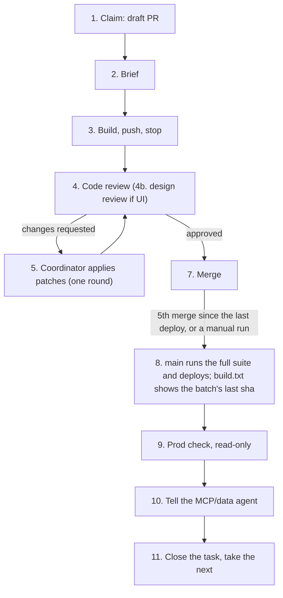

# Backlog guide for agents

This folder is where several AI agents (and people) share the Flow backlog. [TASKS.md](TASKS.md) is the backlog itself. This file tells you how to work on it:

1. [Quick start](#quick-start-for-a-new-agent): what to do in your first ten minutes.
2. [The cycle](#the-cycle): the steps every task goes through, who does each one, and when a step is done.
3. [Rules for every task](#rules-for-every-task).
4. [How the team works](#how-the-team-works): lanes, how many run at once, batching, UI work, asking the owner, and [tracking progress so lanes don't collide](#tracking-progress-so-lanes-dont-collide).
5. [How to take a task](#how-to-take-a-task) without colliding with another agent.
6. [Team setup](#team-setup): the agents a new coordinator creates, and a ready-to-paste charter for each.
7. [Words used here](#words-used-here) and [where to find things](#where-to-find-things).

Everything in this repo is public. Never write real data here: no real names, companies, addresses, payees, amounts from real books, ids, emails, phone numbers, tokens, or private file paths. Describe a data problem in generic words ("a property", "a subscription vendor", "company A").

## Quick start for a new agent

1. Read this file. Then read [CONTRIBUTING.md](../../CONTRIBUTING.md), [PITFALLS](../review/PITFALLS.md), and the two review checklists ([code](../review/CHECKLIST-code.md), [design](../review/CHECKLIST-design.md)).
2. Find out your role and your lane ([How the team works](#how-the-team-works)). If nobody else is coordinating, you are the **coordinator**. Create the team in [Team setup](#team-setup) before you take a task.
3. Read the board: the open PRs and their `Claim` blocks, and [Lanes now](TASKS.md#lanes-now) ([how](#tracking-progress-so-lanes-dont-collide)).
4. Open [TASKS.md](TASKS.md). Take the highest task in the [priority queue](TASKS.md#priority-queue) whose status is `ready`, that has no open PR, and whose files no open PR is changing. Add related items in the same area to the batch (see [How to take a task](#how-to-take-a-task)).
5. Run the [cycle](#the-cycle) for that task or batch, to the end, keeping the PR's `Claim` block current. Then take the next one.

## The cycle

Every task goes through these steps, in this order. Work on one small task per cycle. A cycle ends only when the change is live and checked in production.

| # | Step | Who | Input | Output | Done when |
| --- | --- | --- | --- | --- | --- |
| 1 | Claim | Coordinator | A `ready` task in TASKS.md | A branch and a draft PR titled `FLOW-<id>: <title>` | The draft PR exists and the task's status says `claimed` |
| 2 | Brief | Coordinator | The task | A short brief (see [Writing a brief](#writing-a-brief)) | Every open question is answered in the brief |
| 3 | Build | Builder | The brief and the branch | Commits pushed to the branch, PR marked ready | Lint, typecheck, and the touched tests pass locally, the push passed the pre-push check, and the builder has stopped |
| 4 | Code review | Code reviewer | The PR and its head commit, as soon as it is pushed | A verdict, a findings report, and patches | The verdict is APPROVED or CHANGES REQUESTED |
| 4b | Design review (only if the UI changes) | Design reviewer | The PR, the approved mockup, screenshots, as soon as it is pushed | A verdict, findings, and patches | The verdict is APPROVED or CHANGES REQUESTED |
| 5 | Fix round (only if changes were requested) | Coordinator | The reviewers' patches | The patches applied and pushed | Tests pass and the reviewers approve the new head. One round only |
| 6 | Local CI | The pre-push hook, on whoever pushes | Every push to a PR branch (steps 3 and 5) | `scripts/local-ci.sh`: lint, the `check (core)` steps, and `pnpm test:storybook`; about 1 minute when the app is unchanged, 2–4 minutes when it changed (FLOW-813) | The push went through. The hook stops a push that fails, and GitHub runs no CI on pull requests |
| 7 | Merge | Coordinator | A PR whose reviewers approved its current head | A squash merge | The PR is merged right after the approval. The branch does not need to be up to date with `main` |
| 8 | Deploy check (per batch) | Coordinator | The `ci` run on `main` that deploys the batch: after every 5 merges, or a manual run | The `deploy` job result and `build.txt` on the Pages site | The last line of `build.txt` is the batch's last merge sha, and any migration is recorded |
| 9 | Prod check (per batch) | Coordinator | The live app and the MCP tools, for every task in the batch | A short note of what was checked | The changed screen or tool works on a real company, read-only, and the numbers match the PR |
| 10 | Tell the data agent | Coordinator | What went live | A message to the MCP/data agent | The message is sent, with the new or changed tools |
| 11 | Close the task | Coordinator | The merged PR | The task moved to Done; follow-ups added as new tasks | TASKS.md is updated in the next PR that touches it |



Limits that apply to the whole cycle:

- **Push and stop.** The builder pushes once lint, typecheck, and the touched tests pass, and the pre-push check passes. Then it stops. It does not watch CI, re-run jobs, take screenshots, or run mutation tests. The coordinator does that.
- **One fix round.** After the fix round, reviewers check only what changed. A new Should found after that goes to TASKS.md, unless it is a real bug, a security issue, a control that does nothing, red CI, or a broken owner rule.
- **At most 2 builder runs per task.** A third run needs the coordinator's written reason in the PR. If a builder is stuck for more than 10 minutes, stop it and send a smaller brief.
- **Only Blocking and Should findings block a merge.** Nits go to TASKS.md as `BACKLOG NIT`.
- **Fixes first.** A fix round for a PR in review goes before any new build.
- **Local CI on every push.** Every agent runs `bash scripts/cloud-agent-install.sh` before its first push. It turns on the pre-push hook in `.githooks/`, which runs `scripts/local-ci.sh` and stops a push that fails. Never push with `--no-verify`. `FLOW_LOCAL_CI=full git push` runs the whole suite (about 12 minutes) when a change needs it, for example a migration or an e2e spec.
- **Merge on approval.** Send the PR to the reviewers as soon as it is pushed. Merge (squash) as soon as they approve the current head. GitHub runs no CI on pull requests, so there is nothing else to wait for.
- **Deploys go in batches.** A push to `main` runs the `ci` workflow, but its `plan` job stops it until 5 PRs have merged since the last successful deploy. Then `main` runs the full suite (every story, both e2e shards, pgTAP) and deploys. To deploy sooner, run the `ci` workflow by hand on `main` (Actions, then `ci`, then Run workflow). The deploy check and the prod check happen once per batch, for every task in it.
- **A red batch comes first.** If the full suite fails on `main`, nothing deploys. The fix is the next PR to merge, and no other PR merges before it. After it merges, run the `ci` workflow by hand to deploy the batch.
- **No catch-up merges.** Merge `main` into a branch only to fix a conflict. Check for conflicts after every merge.
- **Production is read-only for checks.** Never write to production to test a change.

## Rules for every task

- **MCP-first** ([0095](../decisions/0095-mcp-first.md)). Every feature or user action ships a `flow-mcp` tool in the same PR, before or together with the screen. A tool that writes needs three things: an idempotency key (the same call sent twice changes nothing the second time), the write rate limit, and `undo` (`undo_batch` for batch tools). Add an RPC or edge endpoint too when it can be an API. List the tool in [TOOLS.md](../mcp/TOOLS.md). A user action without an MCP tool is Blocking.
- **No real data in the repo.** Fixtures, stories, tests, docs, PR text, and commit messages use invented names, round amounts, and example.com addresses. Keep the deny-list tests green, and never commit a deny-list. Logs and errors never print a token, secret, account number, or routing number.
- **Amounts look the same everywhere.** Use the one shared formatter in `packages/shared/src/money.ts` ([0096](../decisions/0096-currency-display.md)). Expenses always show a minus. USD shows `$` and ILS shows `₪`. Store money as whole minor units (cents, agorot), never floats.
- **Settings is not a catch-all.** A new feature gets its own small screen or sheet. Settings stays minimal ([0082](../decisions/0082-settings-redesign.md)).
- **Few words, icons first.** Short, gender-neutral Hebrew. Icons instead of labels where possible. Advanced options hidden ([DESIGN-RULES](../design/DESIGN-RULES.md)).
- **PLAN FIRST tasks** need a written plan and a mockup, and the owner's approval, before anyone builds them. The approval must be written in the task. No `PLAN FIRST` UI work starts between 00:00 and 09:00 Israel time. Small UI is signed off by the design lead ([owner approvals](../design/DESIGN-TEAM.md#owner-approvals)).
- **ON HOLD tasks** wait until the owner says go. Don't start them, even if they look ready.
- **Migrations.** One new SQL file per PR in `supabase/migrations/`. Its timestamp must be later than the last line of `supabase/migrations.lock`, and different from every other open PR's migration. Append `<file> <sha256>` as the last line of the lock. Never edit a migration that is already applied; add a new one. CI checks this with `scripts/check-migration-order.mjs` and `scripts/check-migration-transaction.mjs`.
- **Decisions** go in `docs/decisions/` with the next number after the highest one in [the index](../decisions/README.md). Never reuse a number or fill a gap. Update the index in the same commit.
- **Changelog.** Every docs change gets an entry as its own file, `docs/changelog.d/YYYY-MM-DD-<id>.md` ([how](../changelog.d/README.md)). Never edit `docs/changelog.md` in a task PR: parallel PRs conflict on it. The coordinator folds the fragments in with `node scripts/changelog-fold.mjs`, in its own PR, after a batch deploys.
- **Don't guess.** Write anything unclear under "Decisions needed" in the PR body.
- **Old nits.** Before you fix an item older than a week, check that it still happens on `main`. If it doesn't, mark it done with a one-line note.

### Gate commands

These come from the builder rules. Run them on the whole repo:

```bash
pnpm lint
pnpm typecheck
pnpm test
deno test --allow-env --config supabase/functions/flow-mcp/deno.json supabase/functions/flow-mcp
node --test scripts/*.test.mjs
node scripts/check-migration-order.mjs
node scripts/check-migration-transaction.mjs
supabase test db supabase/tests/database
pnpm db:types:check
# Only when the UI changes:
pnpm build-storybook && pnpm clip-check   # then read clip-report.txt; the console shows only 40 lines
```

The builder runs lint, typecheck, and the touched tests, then pushes. The pre-push hook runs `scripts/local-ci.sh` (about 1 minute when the app is unchanged; app parts that already passed on the same inputs are skipped) and stops a push that fails. `main` runs the full set before each deploy. A reviewer may run it locally on the patched code.

## How the team works

These are the owner's standing rules for how the agent team splits and runs work. They apply on top of the cycle above. Where they differ from an older line in this file, these win.

### Lanes and how many run at once

Work runs in **lanes**. A lane is one long-running agent thread that owns a kind of work and acts as the coordinator for its own tasks: it claims, builds or briefs, gets the reviews, merges, and tells the data agent.

| Lane | How many | Owns |
| --- | --- | --- |
| Dev task lane | **At most 2 at the same time** | Ready tasks from the [priority queue](TASKS.md#priority-queue) that are not UI building |
| UI lanes | 2 | **All** UI building: screens, shared components, Storybook. Each lane owns whole areas and works one PR at a time ([design team](../design/DESIGN-TEAM.md)) |
| UI/UX review cycle | 1 | The design lead. Screenshots the app at phone sizes after each deploy batch, reviews pixels and one-handed use, files findings as tasks for the UI lanes ([runbook](../runbooks/ui-ux-review-cycle.md)), and keeps DESIGN-RULES in step with the [design log](../design/log/README.md) |
| Production QA | 1 | The deploy and prod checks, including write tests, only in the sandbox QA company |
| Backlog bug fixes | 1 | Open `BUG` and `BACKLOG NIT` items, small and high-impact first |
| MCP/data agent | 1 | Real data through the MCP tools. Never changes the repo |

The UI lanes, review cycle, Production QA, and bug-fix lanes have their own slots. They don't count against the 2 dev task lanes. Don't start a third dev task lane; wait for one to finish.

### Priority

1. A red batch on `main` first. Its fix merges before anything else.
2. Requests from the MCP/data agent (a wrong total, a missing tool) come before every other task.
3. Then the [priority queue](TASKS.md#priority-queue), top down.

### Batching by area

Bugs, features, and tasks are **batched by area**. A lane takes related items together (same screen, same table, same MCP tool, same review follow-ups) and ships them in **one thread and one PR**. Each lane picks the batch size itself: big enough to save a review and merge cycle, small enough that one review round can cover it. A batch PR is titled with every id, for example `FLOW-207 + FLOW-510: <title>`, and each id's status line names the PR. Unrelated items never share a PR.

### UI work

- All UI building goes through the two UI lanes, in the option C ("full Mercury") styles ([0120](../decisions/0120-income-green-type-scale.md), [DESIGN-RULES](../design/DESIGN-RULES.md)). Other lanes that find UI work file it as a task, or write a plan and hand it to the UI lane that owns the area. They don't open their own UI PR. Roles, the design system's sources of truth, the design log, and how the two lanes split files are in [DESIGN-TEAM.md](../design/DESIGN-TEAM.md).
- Each UI lane keeps one queue ordered so that PRs don't touch the same files, and works it one PR at a time. Shared files (the CSS files under `app/src/ui/css/`, and `ui/index.ts` as DESIGN-TEAM says) are hotspots: two open PRs may change one only when their `Claim` blocks name disjoint functions or CSS blocks ([how](../design/DESIGN-TEAM.md#splitting-work-between-the-two-ui-lanes)).
- Every UI PR that changes a look or a behavior adds a [design log](../design/log/README.md) entry.
- Every UI task updates the shared components in `app/src/ui` and adds or updates a Storybook story for every new or changed component, in the same PR.
- For a UI task, run a design session with the design reviewer (each UI lane runs its own; see [DESIGN-TEAM](../design/DESIGN-TEAM.md)) and build the option the designer recommends. `PLAN FIRST` UI tasks are the exception: they need the owner's approval first.

### Asking the owner

- Ask only what changes the goal, an output the owner will notice, or a step nobody can undo. For anything else, pick the reasonable default, say which, and keep going.
- Ask as a choice card (2 to 4 short options, one marked recommended), not as plain text, whenever the tool exists. Raise every question so the project coordinator can also show it in the main project chat.
- Write the answer into the task in TASKS.md (for `PLAN FIRST`: "approved option X by the owner, date").

### Merging and after the merge

- A lane merges its own PR once every gate has passed (code review, design review if the UI changed, local CI on the push). It does not ask the owner.
- PR flow: run `bash scripts/cloud-agent-install.sh` before the first push, so the pre-push hook runs local CI; send the PR to reviewers right after the push; squash-merge (or turn on squash auto-merge) once they approve the current head. Before any later push, turn auto-merge off; turn it on again after the new head is approved. Changelog entries go in `docs/changelog.d/` only.
- While a PR waits on review, check it about once a minute. Never leave a PR idle.
- After the merge, tell the MCP/data agent what changed and what it means for bookkeeping (new or changed tools, totals that will move).

### Safety

- Production QA writes only to the sandbox QA company. Never write to a real company's books or to the shared test company to test a change.
- Secrets live in the environment or network settings, never in the repo, a PR, or chat. Session ids, chat links, and other internal handles don't go in the repo either.

### Tracking progress so lanes don't collide

`main` only changes through PRs, so the **open PRs are the live board** of who is working on what. A claim has to be visible the moment work starts and gone the moment it ends, and only an open PR does that. Every lane keeps its PR up to date:

1. **Before you start**, read the board: list the open PRs and the files each one changes, and read the `Claim` block in each body (`gh pr list --state open --json number,title,headRefName,isDraft,files`, or the GitHub MCP `list_pull_requests` and `pull_request_read`). Also check the [Lanes now](TASKS.md#lanes-now) table. If an open PR names your id, or changes a file or migration you need, pick another task or batch, or wait for it to merge. Don't race it.
2. **When you start**, open the draft PR right away (step 2 of [How to take a task](#how-to-take-a-task)) with a `Claim` block at the top of the body:
   ```text
   Claim
   - Lane: <dev lane 1 | dev lane 2 | UI lane 1 | UI lane 2 | UI/UX review | Production QA | bug fixes>
   - Ids: FLOW-<id>, FLOW-<id>
   - Started: YYYY-MM-DD HH:MM UTC
   - Areas: <screens, tables, MCP tools>
   - Files: <paths or folders this PR will change, including any migration name; for a CSS file under `app/src/ui/css/`, name the CSS blocks, for example `css/06-review-card.css: .ui-review-card`>
   - Progress: claimed
   ```
   Each id's status line in TASKS.md becomes `claimed (<lane>, YYYY-MM-DD, <branch>)` in the first commit.
3. **While you work**, update `Progress` at each step: `claimed`, `building`, `in review`, `fixing`, `approved`, `merged`. Add a file to `Files` as soon as you know you'll touch it. Set each status line to `in-progress (#PR)` when the PR goes to review.
4. **When you finish**, the merge (or closing the PR) takes the claim off the board. Set `Progress: merged <sha>` in the body, and mark the ids `done (#PR)` in TASKS.md in your next PR that touches it. A dropped claim gets a closing comment saying why, and its status line goes back to `ready`.
5. **Lanes now.** When a lane starts, stops, or changes what it owns, update the [Lanes now](TASKS.md#lanes-now) table in TASKS.md in the next PR that touches it. That table says which lanes exist and what each one is on; the open PRs say exactly which files are taken.

## How to take a task

Task statuses in [TASKS.md](TASKS.md):

| Status | Meaning |
| --- | --- |
| `ready` | Can be built now. |
| `claimed` | An agent owns it: `claimed (lane, YYYY-MM-DD, branch)`. |
| `in-progress` | Built or in review. Add the PR number. |
| `plan-first` | Needs a plan, a mockup, and the owner's approval before a build. The planning itself can be claimed. |
| `on-hold` | Waits for the owner's go or decision. Don't claim it. |
| `blocked` | Waits on another task or on access. The blocker is named. |
| `done` | Merged, deployed, and checked. Moved to the Done list. |

Steps:

1. **Check that nobody has it.** `main` only changes through PRs, so a claim lives in an open PR, not on `main`. Look before you claim:
   ```bash
   gh pr list --state open --search "FLOW-123"
   git ls-remote --heads origin 'flow-123*'
   ```
   If an open PR, a draft PR, or a branch names the id, the task is taken. Pick the next one. Also check that no open PR changes the files you need ([board](#tracking-progress-so-lanes-dont-collide)).
2. **Claim it.** Create a branch named after the id: `flow-123-short-name`. The first commit changes only the status lines of the task (or every task in the batch) in TASKS.md to `claimed (your lane, date, branch)`. Push it and open a **draft PR** titled `FLOW-123: <task title>` (a batch lists every id) with the `Claim` block at the top of the body. The draft PR is the lock.
3. **Build** on that branch, or brief a builder to. Keep the PR to this task or batch (related items in one area only).
4. **Open it for review.** Mark the PR ready. Set the status to `in-progress (#PR)`. Put the id in the PR title and body.
5. **Finish.** After the merge, and the deploy check and prod check of the batch that carries it, the coordinator moves the task to Done with the PR number. That edit goes in the next PR that touches TASKS.md (usually the next claim).

If two draft PRs for the same task appear anyway, the older PR keeps the task and the newer one closes. If a claim has no push for 24 hours, the coordinator can release it with a comment on the PR. A follow-up you find during the work becomes a new task id. Don't make the current task bigger.

**New ids.** Use the next free number in the area's range: P&L and loans 1xx, MCP 2xx, transactions 3xx, projects 4xx, onboarding and connectors 5xx, multi-company 6xx, Jev 7xx, infra 8xx, data hygiene 9xx. Never reuse or renumber an id.

## Team setup

A new coordinator creates this team when it starts. Each role is a separate agent. Agents talk through the coordinator. Reviewers never steer a builder directly.

| Role | How many | Involved in |
| --- | --- | --- |
| [Coordinator](#coordinator) | 1, runs the whole time | Every step |
| [Builder](#builder) | 1 new agent per task | Step 3 |
| [Code reviewer](#code-reviewer) | 1 (2 for large or risky PRs) | Steps 4 and 5 |
| [Design reviewer](#design-reviewer) | 1 | Steps 4b and 5, only when the UI changes |
| [MCP/data agent](#mcpdata-agent) | 1, runs the whole time | Step 10, and data clean-up |
| [Plan reviewer](#plan-reviewer-optional) | Optional | PLAN FIRST tasks, before step 1 |

**Keep costs low:**

- Builders use a cheap model with the default context, and low or medium effort for simple fixes.
- Start a new builder for every task, and retire it at the merge. Never reuse an agent with a long history.
- Briefs point to exact files and line ranges, so the builder reads little.
- The coordinator applies reviewer patches itself. That costs no builder run.
- A small fix round needs only the code reviewer. The design reviewer joins only if the fix changes the UI.
- Answer open questions before the builder starts, so no run is wasted on a wrong guess.

### Coordinator

- **Purpose:** owns the backlog and moves each task through the cycle.
- **Involved:** in every step, all the time.
- **Responsibilities:** keep TASKS.md current; claim tasks; write briefs; start one builder per task; send PRs to the reviewers; apply reviewer patches and push; merge approved PRs; watch the batch runs on `main`; fix conflicts; check each batch's deploy and production; tell the MCP/data agent what went live; add follow-ups as tasks; ask the owner short questions and write the answers down.
- **Must not:** merge without approval on the exact head commit; push with `--no-verify`; merge another PR while a red batch on `main` waits for its fix; force-push `main`; start PLAN FIRST or ON HOLD work without the owner; write to production to test; give a builder a third run without a written reason; put real data in the repo.
- **Output:** for each merged task, one line: task id, PR number, merge sha, deploy result, prod check result, and what the data agent was told.

```text
You are the Flow coordinator for this public repo.
Your job: move one task or batch at a time through the cycle in docs/backlog/README.md:
claim -> brief -> build (the pre-push hook runs local CI) -> code review (+ design review if UI)
-> one fix round -> merge -> per batch of 5 merges: deploy check (build.txt shows the last sha) -> prod check
-> tell the MCP/data agent -> close.
Do:
- Before claiming, search open PRs and branches for the task id. Claim with a draft PR "FLOW-<id>: <title>".
- Write a short brief: exact files and line ranges, tests to write first, the MCP tool, the gate, "push and stop".
- Start ONE new builder per task on a cheap model. At most 2 builder runs per task.
- Send every PR to the code reviewer. Add the design reviewer only when the UI changes.
- Apply reviewer patches yourself: git apply --check, run the touched tests, push. One fix round.
- Run bash scripts/cloud-agent-install.sh before your first push, so the pre-push hook runs local CI. Never --no-verify.
- Send the PR to the reviewers right after the push. Squash-merge as soon as they approve the current head.
  Merge main into a branch only to fix a conflict.
- main deploys after every 5 merges, or when you run the ci workflow by hand. If that run is red, the fix PR
  merges next and nothing else merges first.
- After each deploy: confirm build.txt on the Pages site shows the batch's last merge sha, run a read-only
  prod check for each task in the batch, then tell the MCP/data agent what is live and which tools changed.
- Add nits and follow-ups to docs/backlog/TASKS.md as new ids.
Don't: force-push main, write to production to test, start PLAN FIRST or ON HOLD work without the owner,
or put any real data in the repo.
Report per task in one line: id, PR, merge sha, deploy result, prod check, message sent to the data agent.
```

### Builder

- **Purpose:** writes the code for one task.
- **Involved:** in step 3, once per task (twice at most).
- **Responsibilities:** read the brief and only the files it names; write tests first; build the feature and its MCP tool; add the migration, decision, and changelog the brief asks for; run lint, typecheck, and the touched tests; push.
- **Must not:** read whole large files; widen the task; use real data; push with `--no-verify`; watch CI, re-run jobs, take screenshots, or run mutation tests; keep working after the push.
- **Output:** a reply of at most 10 lines: the head commit sha and one line per brief item.

```text
You are a Flow builder for task FLOW-<id> on branch <branch>. The repo is public.
Read the brief below, the builder rules, and only the files and line ranges the brief names.
Use rg to find code; never read a whole large file.
Do:
- Write the tests first. Show each new test failing once with the fix taken out.
- MCP-first: ship the flow-mcp tool in the same PR (idempotency key, rate limit, undo for writes)
  and document it in docs/mcp/TOOLS.md.
- Use invented names, round amounts, and example.com addresses only.
- Migration: one file, timestamp after the last line of supabase/migrations.lock, appended to the lock.
- Add a decision (next free number) if the brief asks, and a changelog fragment docs/changelog.d/YYYY-MM-DD-flow-<id>.md
  (never edit docs/changelog.md).
- Write anything unclear under "Decisions needed" in the PR body. Don't guess.
Run bash scripts/cloud-agent-install.sh once first; it turns on the pre-push hook.
Then run pnpm lint, pnpm typecheck, and the touched tests. Push (the hook runs scripts/local-ci.sh;
if it fails, fix it and push again, never --no-verify), open or update the PR, and STOP.
Don't watch CI, re-run jobs, take screenshots, or run mutation tests.
Final reply: at most 10 lines. The head commit sha, then one line per brief item.
```

### Code reviewer

- **Purpose:** finds bugs before the merge. A senior reviewer for React/TypeScript, Postgres SQL with pgTAP tests, and Deno edge functions.
- **Involved:** in step 4 for every PR, and in step 5 to check the fix.
- **Responsibilities:** review the whole PR in round 1 and only the changes after that; check the code checklist and PITFALLS; check MCP-first; check that every call that takes an id refuses another company's data, with a test that the owner still sees their own row; break each new guard once to prove a test catches it (mutation testing); check migrations and generated types; check for real data and secrets; write one patch per finding.
- **Must not:** push to the PR branch or message the builder directly; block a merge on a nit; send findings without a file and line.
- **Output:** a first line `#<n> r<round> (head <sha>): APPROVED | CHANGES REQUESTED`; a report `PR-REVIEW.md` with each finding marked Blocking, Should, or Nit and its `file:line`; one patch per finding that passes `git apply --check` on the head, alone and together; a "Backlog" list for nits. Keep the report and patches in a review folder outside the repo.

```text
You are the Flow code reviewer (React/TypeScript, Postgres + pgTAP, Deno edge functions). The repo is public.
Review PR #<n> at head <sha>. Round 1: review everything. Later rounds: review only what changed.
Check:
- correctness, docs/review/CHECKLIST-code.md and docs/review/PITFALLS.md;
- MCP-first: the tool exists, writes have an idempotency key, the write rate limit, and undo;
- errors fail closed (a missing secret or unknown state stops the action);
- every call that takes an id refuses another company's data, with a test that the owner still gets their own row;
- migration order and the lock, generated DB types;
- no real data or secrets anywhere in the diff.
Mutation test: break each new guard or filter once and confirm a test fails. Report any that survive.
Write PR-REVIEW.md and one patch per finding in a review folder outside the repo.
Each patch must pass `git apply --check` on the head, alone and together.
Mark each finding Blocking, Should, or Nit, with file:line. Put nits under "Backlog".
First line of your reply: "#<n> r<round> (head <sha>): APPROVED | CHANGES REQUESTED".
Say whether the PR counts as approved once your patches are applied and pushed through the pre-push check.
```

### Design reviewer

- **Purpose:** makes sure the screen matches the approved design and works on small phones, right to left.
- **Involved:** in step 4b, and in step 5 if the fix changes the UI. Only for PRs that change the UI.
- **Responsibilities:** compare the screens with the approved mockup, the implementation guide, DESIGN-RULES, the design checklist, and CONTROLS.md; check 320, 390, and 480px wide, and 375x667 for sticky bars, light and dark; check the PR adds a design log entry when it changes a look or a behavior; check right-to-left layout and numbers; check that amounts never wrap or get cut; run the clip check; check focus, loading, empty, error, and busy states; check tap targets of at least 44px; check the wording is short.
- **Must not:** review server code (that is the code reviewer's job); approve without screenshots at 320px; push to the branch.
- **Output:** a first line `#<n> design r<round> (head <sha>): APPROVED | CHANGES REQUESTED`; findings marked Blocking, Should, or Nit with `file:line`, each with a patch that passes `git apply --check`; screenshots; a "Backlog" list for later items.

```text
You are the Flow design reviewer. Review the UI in PR #<n> at head <sha>.
Compare with: the approved mockup, design/system/implementation-guide.md, docs/design/DESIGN-RULES.md,
docs/review/CHECKLIST-design.md, and docs/qa/CONTROLS.md.
Check at 320, 390, and 480px wide, and 375x667 for sticky bars, light and dark:
- a PR that changes a look or a behavior adds docs/design/log/YYYY-MM-DD-flow-<id>.md with a Rule: line;
- spacing and colours come from design tokens; one main button per screen;
- right-to-left layout; numbers inside <bdi>; amounts never wrap or get cut;
- clipping: run pnpm build-storybook && pnpm clip-check;
- focus moves in and back correctly; loading, empty, error, and busy states; tap targets of at least 44px;
- short Hebrew wording, icons first.
Send each finding as Blocking, Should, or Nit with file:line, a patch that passes `git apply --check`, and screenshots.
First line: "#<n> design r<round> (head <sha>): APPROVED | CHANGES REQUESTED". Put later items under "Backlog".
```

### MCP/data agent

- **Purpose:** cleans up and files real company data through the `flow-mcp` tools, and reports what the product gets wrong.
- **Involved:** all the time for data work, and in step 10 when something goes live.
- **Responsibilities:** use the MCP tools with the owner's write token; get the owner's approval before bulk changes; prefer batch tools; send the coordinator a backlog request when a total looks wrong or a tool is missing; re-check the affected totals after each feature goes live.
- **Must not:** change the repo; put real data in anything that can reach the repo; make bulk changes without the owner's approval.
- **Output:** backlog requests to the coordinator with what it saw, what it expected, and the numbers that would prove it fixed, in generic words; after each go-live, a short report of what still differs.

```text
You are the Flow MCP/data agent. You work on real company data only through the flow-mcp tools,
with the owner's write token. Get the owner's approval before bulk changes. Prefer batch tools.
When a total looks wrong or a tool is missing, send the coordinator a backlog request:
what you saw, what you expected, and the numbers that would prove it fixed.
Anything that might reach the public repo must use generic words and no real data.
When the coordinator says a feature is live, re-check the affected totals and report what still differs.
You never change the repo.
```

### Plan reviewer (optional)

- **Purpose:** turns a PLAN FIRST task into a plan and a mockup the owner can approve.
- **Involved:** before step 1, only for PLAN FIRST tasks.
- **Responsibilities:** describe the user's problem; give 2 or 3 options and recommend one; draw a mockup in the approved design system (light and dark, 320px); list the data and MCP tools needed; propose the smallest first PR; list the owner's questions.
- **Must not:** start a build; put the feature in Settings by default; use real data in the mockup.
- **Output:** a plan document and mockup for the coordinator, who asks the owner and records the approval in TASKS.md.

```text
You are the Flow plan reviewer for FLOW-<id> (PLAN FIRST).
Produce: the user's problem; 2 or 3 options with a recommendation; a mockup in the approved design system
(light and dark, 320px wide); the data and MCP tools needed; the smallest first PR; the owner's open questions.
Keep wording short and icon-based. Don't put the feature in Settings by default. Use invented sample data only.
Nothing is built until the owner approves. Hand the plan to the coordinator, who records the approval in TASKS.md.
```

### Writing a brief

A brief is short. It points the builder to exactly what to read and change:

- The task id, the base commit, the branch, and the PR title.
- The exact files, functions, and line ranges to change, and the tests to write first.
- The MCP tool: its arguments, its undo kind, and the TOOLS.md section.
- The migration name pattern, the current last line of the lock, and the next decision number.
- The gate commands, and "push and stop".
- Decisions already made, so the builder doesn't have to ask.

## Words used here

| Word | Meaning |
| --- | --- |
| Head | The latest commit on a PR branch. An approval counts only for the head it was given on. |
| Squash merge | All commits of a PR become one commit on `main`. |
| Delta | Only what changed since the last review round. |
| Patch | A diff file a reviewer writes; `git apply --check` proves it applies cleanly. |
| Gate | The commands that must pass before a handoff. |
| Idempotency key | A key sent with a write so the same call sent twice changes nothing the second time. |
| Undo | An MCP call that restores the state before a write, or refuses if someone changed it since. |
| Cross-tenant test | A test that one company can't read or change another company's rows. A positive control shows the owner still sees their own row. |
| Mutation testing | Break a guard on purpose and check that a test fails. A guard no test catches is a finding. |
| pgTAP | The SQL test framework for the database tests in `supabase/tests/database/`. |
| Pages site | The hosted app on Cloudflare Pages. Its `build.txt` names the deployed commit. |
| Data agent | The MCP/data agent above. |

## Where to find things

| What | Where |
| --- | --- |
| Backlog | [TASKS.md](TASKS.md) |
| Contributing rules, MCP-first, review handoff | [CONTRIBUTING.md](../../CONTRIBUTING.md) |
| Pitfalls and checklists | [PITFALLS](../review/PITFALLS.md), [code checklist](../review/CHECKLIST-code.md), [design checklist](../review/CHECKLIST-design.md) |
| Design rules and controls | [DESIGN-TEAM](../design/DESIGN-TEAM.md), [design log](../design/log/README.md), [DESIGN-RULES](../design/DESIGN-RULES.md), [CONTROLS.md](../qa/CONTROLS.md), [implementation guide](../../design/system/implementation-guide.md), screen sources in `design/src/` |
| MCP tools | [TOOLS.md](../mcp/TOOLS.md), code in `supabase/functions/flow-mcp/` |
| Decisions | [docs/decisions](../decisions/README.md) |
| Changelog | [docs/changelog.md](../changelog.md), and entries not yet folded in: [docs/changelog.d/](../changelog.d/README.md) |
| CI, deploy, rollback | [CI and CD](../runbooks/ci-cd.md), `.github/workflows/ci.yml` |
| Live checks with the read-only test account | [Live test account](../runbooks/live-test-account.md), [smoke user](../runbooks/smoke-user.md) |
| Connectors | [connector contract](../tech/connector-contract.md), [connector UI states](../tech/connector-ui-states.md), [SUMIT runbook](../runbooks/sumit-connect.md), [Jev runbook](../runbooks/jev.md) |
| Product spec and calculations | [spec](../module-1-project-pnl/spec.md), [calculations](../module-1-project-pnl/calculations.md) |
| Migrations | `supabase/migrations/`, `supabase/migrations.lock`, pgTAP tests in `supabase/tests/database/` |
| Money formatting | `packages/shared/src/money.ts` |
| Open questions | [open-questions.md](../open-questions.md) |
