# Module 1 — Screens

Each section is one wireframe. Figures are example data for September 2026, not a real company. Two example companies appear: screens from the first pass use three projects, and the v2 Home uses a larger company (17 active projects this month). Do not expect the month totals on Home to equal the lifetime totals on a project screen. Home is the current period. The project screen is since the job started.

The phone UI is Hebrew, right to left. Profit is green, loss is red, and a negative amount uses a minus sign. Income and expense totals on the summary tiles are neutral. The English notes beside the phone in the PNG are annotations for design review. They are not in the product.

Build the approved screens. Superseded screens are kept below and marked.

| Build this | File |
| --- | --- |
| Home | [01-home-v2](#01-home-v2) |
| Project | [02-project](#02-project) |
| Review | [03-review](#03-review) |
| Add | [04-add](#04-add) |
| Projects | [05-projects](#05-projects) |
| Change sheet | [06-change-sheet-v2](#06-change-sheet-v2) |
| Categories | [07-categories](#07-categories) |
| Upload results | [08-upload-results](#08-upload-results) |

`הגדרות` (Settings) is a tab in the bottom bar. Its screen is not wireframed. See [open questions](../open-questions.md).

Behavior that these screens illustrate is specified in [spec.md](spec.md).

## 01-home-v2 — Home, many projects

**Status:** Approved. This is the Home to build.
**Supersedes:** [01-home](#01-home).
**File:** [wireframes/01-home-v2.png](wireframes/01-home-v2.png)

### Purpose

The same company answer as the first Home — "am I making money this period?" — when the business has too many jobs to list. Company totals include every project and overhead. The list shows only where to look next.

### Main elements

- Greeting `שלום, יוסי` and the line `סיכום החברה · 17 פרויקטים פעילים · ספטמבר 2026`. A menu button (`☰`) sits at the end of the top bar. What it opens is not specified.
- Period switch: `החודש` (selected) and `מתחילת השנה`.
- Three tiles: `הכנסות` ₪1,310,000, `הוצאות` ₪1,110,000, `רווח/הפסד` ₪200,000 in green. The profit tile is emphasized.
- Pending banner: a count badge `7` and `7 פריטים ממתינים לאישור`, with a chevron.
- Section `פרויקטים · 5 המובילים` and a sort pill: `לפי פעילות` (selected) and `הפסד קודם`.
- Five compact rows. Each row is a name, the profit or loss, and a bar (gray expenses, green profit, or red loss). There is no income/expense subtitle on the row.
  - `בניין מגורים חולון` ₪80,000
  - `וילה רעננה` ₪50,000
  - `מגדל משרדים פ"ת` ₪40,000
  - `בית פרטי כפר סבא` ₪30,000
  - `שיפוץ דירה ת"א` −₪10,000
- Collapsed row: `עוד 12 פרויקטים · ₪70,000 רווח`.
- Dashed overhead row: `הוצאות כלליות · תקורה`, −₪60,000.
- Bottom nav: `בית` (active), `פרויקטים`, center `+`, `לאישור` with badge `7`, `הגדרות`.

The example arithmetic, so the tiles can be checked against the rows: top-5 income 910,000 plus the other 12 at 400,000 is 1,310,000. Top-5 expenses 720,000 plus the other 12 at 330,000 plus overhead 60,000 is 1,110,000. Profit is 200,000. The collapsed row's ₪70,000 is 400,000 − 330,000. The on-screen top 5 do not add up to the company profit, and they are not supposed to.

### Key interactions

- The period switch recalculates the tiles, the top 5, the collapsed profit, and overhead.
- The sort pill rebuilds the top 5. `לפי פעילות` is the most cash movement this month. `הפסד קודם` surfaces losing jobs. Overhead stays the last row. The rest stay collapsed.
- Tapping a project row opens that project. Tapping the collapsed row opens the projects list. Tapping overhead opens the overhead view (company costs that are not a job).
- The pending banner opens the review queue.
- The center `+` opens the add sheet from any tab.

### Wireframe

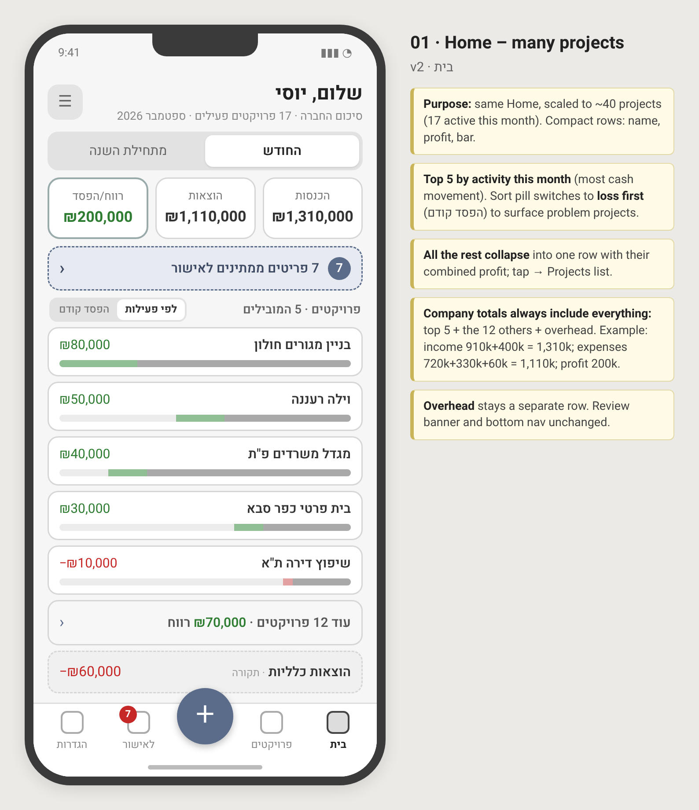

### Detailed spec: TODO

Fields, component states, empty states, loading and error states, and edge cases for this screen are not specified yet. In particular: a month with no projects, all projects profitable, fewer than five projects, and what the `☰` button opens.

## 02-project — Project

**Status:** Approved.
**File:** [wireframes/02-project.png](wireframes/02-project.png)

### Purpose

Answer "is this job profitable?" for one project, from the day it started, and show where the expenses went.

### Main elements

- Back button, title `וילה רעננה`, subtitle `לקוח: משפ׳ כהן · מתחילת הפרויקט`, and a `⋯` menu.
- Three tiles: `הכנסות` ₪900,000, `הוצאות` ₪720,000, `רווח · 20%` ₪180,000. Margin is profit divided by income (180,000 / 900,000).
- Budget card `הוצאות מול תקציב`: ₪720,000 / ₪1,000,000, a bar filled to 72%, caption `72% נוצל · אופציונלי`. The card is on this screen because the example job has a budget. [0014](../decisions/0014-optional-project-budget.md): budget is optional, and this card appears only when a budget is set.
- `לפי קטגוריה`: one bar per expense category, scaled to the largest bar. The example sums to the expenses tile: `חומרים` ₪300,000, `קבלני משנה` ₪220,000, `עבודה` ₪120,000, `ציוד והשכרה` ₪40,000, `הובלה` ₪20,000, `ביטוח` ₪10,000, `אחר` ₪10,000.
- `תנועות אחרונות` with an "all" chevron (`הכל`). Three example rows, source mark plus signed amount:
  - Invoice, `טמבור בע"מ`, `חומרים · 22/09`, −₪12,000
  - Bank, `העברה מהלקוח – משפ׳ כהן`, `הכנסה · 20/09`, +₪150,000
  - Invoice, `אבי חשמל`, `קבלני משנה · 18/09`, −₪18,000
- Bottom nav with `פרויקטים` active.

### Key interactions

- Back returns to the list or Home, whichever opened the project.
- The `⋯` menu, from the annotation on this wireframe: edit name, client, and budget, and close the project (status becomes finished).
- Tapping a category focuses that category's transactions. Tapping a transaction opens it for a project or category change (the change sheet).
- `הכל` opens the full transaction list for the project. That list is not a separate wireframe yet.

### Wireframe

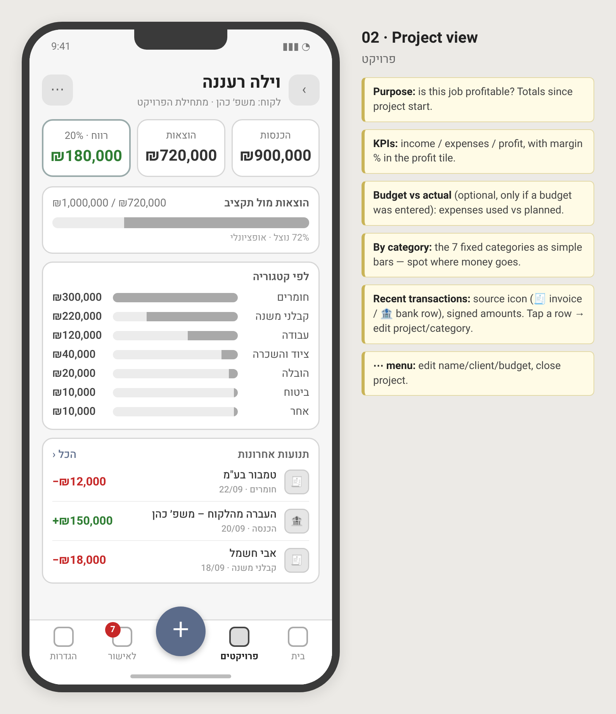

### Detailed spec: TODO

Fields, component states, empty states, loading and error states, and edge cases for this screen are not specified yet. In particular: a project with no transactions, a project with no budget (the budget card is omitted), a finished project opened from reports, and the overhead screen if it reuses this layout.

## 03-review — Review queue

**Status:** Approved.
**File:** [wireframes/03-review.png](wireframes/03-review.png)

### Purpose

Confirm what the product is not sure about. The owner approves or corrects one item, and the queue advances. [0011](../decisions/0011-auto-approve-high-confidence.md): a bank row matched to an invoice, or a row covered by a supplier rule, never reaches this queue. It is auto-approved, listed in a short summary, and can be reopened. The `אשר הכל` button on this wireframe is the earlier sketch of that bulk step.

### Main elements

- Title `לאישור`, subtitle `מה שה-AI לא היה בטוח בו`.
- Position pill `3 מתוך 7` and a seven-segment progress bar with three segments filled.
- One card:
  - A thumbnail placeholder labeled `חשבונית`.
  - Source line `חשבונית מצולמת` with a camera mark.
  - Supplier `חומרי בניין השרון בע״מ`, date `21/09/2026`.
  - Net amount ₪8,500, and under it `לפני מע״מ · מע״מ ₪1,530` (the example VAT is 18% of the net).
  - `הצעת AI`: project chip `וילה רעננה` at 92%, category chip `חומרים` at 95%.
- Primary button `אישור` (with a check) and secondary button `שינוי`.
- Caption `אחרי שינוי – נזכור את הבחירה לספק הזה`.
- Dashed button `אשר הכל · 4 בביטחון גבוה`.
- Text button `דלג`.
- `הבא בתור`: a dimmed bank row, `העברה ל״מ.ש. הובלות״`, `שורת בנק · 19/09 · לא הותאם`, −₪3,000.
- Bottom nav with `לאישור` active and badge `7`.

### Key interactions

- `אישור` accepts the chips, marks the transaction approved, and brings the next card up.
- `שינוי`, or tapping a chip, opens the change sheet ([06-change-sheet-v2](#06-change-sheet-v2)).
- `אשר הכל` is drawn on the wireframe as a bulk confirm for four high-confidence items. Under [0011](../decisions/0011-auto-approve-high-confidence.md) those items are already approved before this screen, so the proof of concept does not depend on this tap. The summary they land in is not wireframed yet.
- `דלג` parks the card and moves on. The item stays suggested and out of reports.
- The thumbnail opens the document larger. That viewer is not wireframed.
- The dimmed "next" row is a preview, not a second set of actions.

### Wireframe

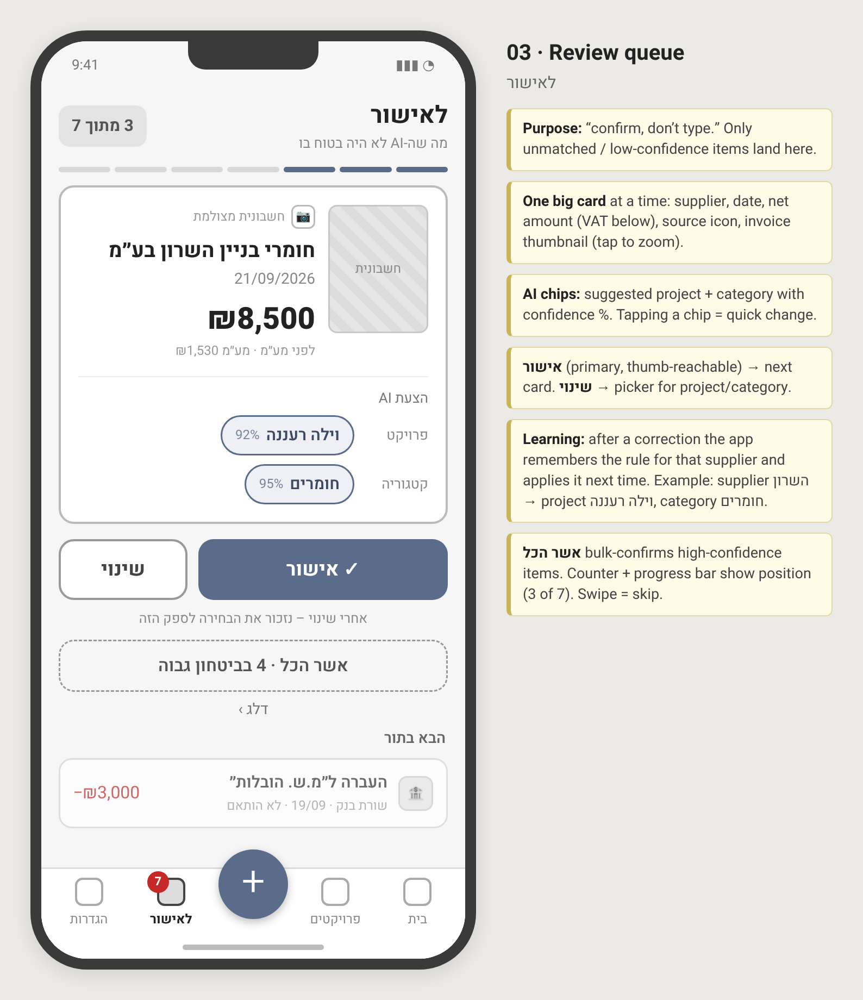

### Detailed spec: TODO

Fields, component states, empty states, loading and error states, and edge cases for this screen are not specified yet. In particular: an empty queue, a card that is a bank row with no thumbnail, a duplicate invoice, and the auto-approve summary (not drawn here) from which the owner reopens an item.

## 04-add — Add sheet

**Status:** Approved.
**File:** [wireframes/04-add.png](wireframes/04-add.png)

### Purpose

The only way to bring new data in. The center `+` opens this sheet on top of whatever screen the owner was on. The wireframe draws it over Home.

### Main elements

- Scrim over the screen behind.
- Sheet title `הוספה`.
- Subtitle `ה-AI ישייך לפרויקט ולקטגוריה – אתה רק מאשר`.
- Three large rows:
  - `צלם חשבונית` — `מצלמה או PDF · קורא ספק, סכום, מע״מ ותאריך`
  - `העלה דוח בנק/אשראי` — `קובץ Excel / CSV · התאמה אוטומטית`
  - `הזנה ידנית` — `סכום, פרויקט וקטגוריה – במקרה הצורך`
- `ביטול`.

### Key interactions

- `צלם חשבונית` opens the camera or a PDF picker. After extraction, the document enters matching and, if it is not high confidence, the review queue.
- `העלה דוח בנק/אשראי` picks an Excel or CSV file and then shows [upload results](#08-upload-results). In the proof of concept that file is a Bank Hapoalim (`בנק הפועלים`) statement. [0012](../decisions/0012-bank-hapoalim-first.md). The label still mentions credit (`אשראי`); credit-card company files are later.
- `הזנה ידנית` is the cash and cheque fallback. The form itself is not wireframed.
- `ביטול`, or tapping the scrim, closes the sheet and leaves the data unchanged.

### Wireframe

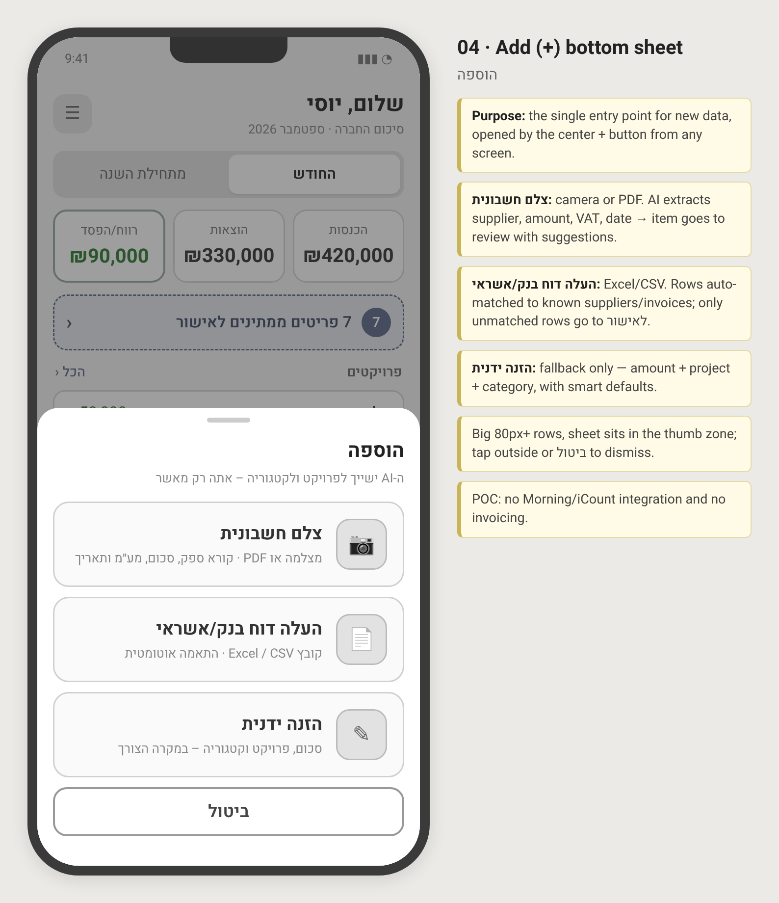

### Detailed spec: TODO

Fields, component states, empty states, loading and error states, and edge cases for this screen are not specified yet. In particular: camera permission denied, a PDF with several invoices, a file that is not a statement, and the manual-entry form.

## 05-projects — Projects list and create

**Status:** Approved.
**File:** [wireframes/05-projects.png](wireframes/05-projects.png)

### Purpose

Every active project, with profit since the job started, and a short form to add one. The wireframe shows the create sheet already open over the list so both states are in one picture. In the product the sheet opens when the owner taps `+ פרויקט חדש`.

### Main elements

List, behind the sheet:

- Title `פרויקטים`, subtitle `3 פעילים · רווח מתחילת הפרויקט`, search button.
- Primary button `+ פרויקט חדש`.
- `וילה רעננה`, profit ₪180,000, `משפ׳ כהן · פעיל · הכנסות ₪900,000`.
- `בניין מגורים חולון`, profit ₪350,000, `יזם: א.ב. נכסים · פעיל · הכנסות ₪1,500,000`.
- `שיפוץ דירה ת"א`, loss −₪15,000, `משפ׳ לוי · פעיל · הכנסות ₪200,000`.
- Collapsed finished group: `הסתיימו` with `הצג`.
- Bottom nav with `פרויקטים` active.

Create sheet, in front:

- Title `פרויקט חדש`.
- `שם הפרויקט` (required), focused, example text `גן יבנה – תוספת קומה`.
- `לקוח (אופציונלי)`, placeholder `שם לקוח`.
- `תקציב (אופציונלי)`, placeholder `₪`.
- `צור פרויקט`.

### Key interactions

- A project row opens [the project screen](#02-project).
- Search (`⌕`) finds a job by name when the list is long. Finished jobs are included in search; they stay collapsed until `הצג`.
- `צור פרויקט` requires a name. Client and budget can be left empty and filled later from the project menu.
- The sheet dismisses the same way as Add: cancel or scrim. The wireframe does not draw a cancel button on this sheet.

### Wireframe

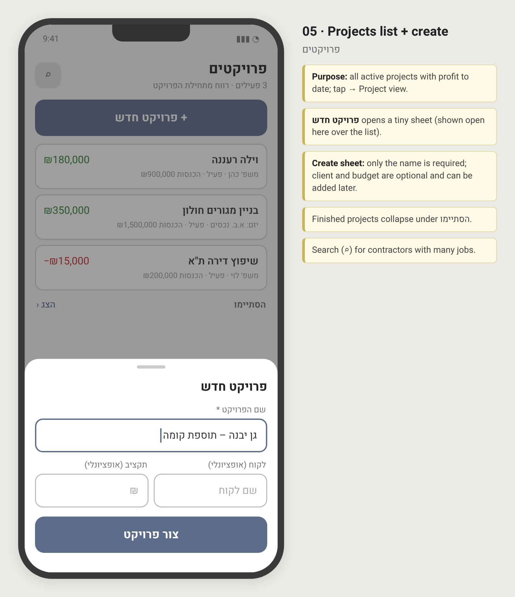

### Detailed spec: TODO

Fields, component states, empty states, loading and error states, and edge cases for this screen are not specified yet. In particular: the first-run empty list, duplicate names, where the project code is assigned, and the expanded `הסתיימו` list.

## 06-change-sheet-v2 — Change sheet, scalable picker

**Status:** Approved. This is the change sheet to build.
**Supersedes:** [06-change-sheet](#06-change-sheet).
**File:** [wireframes/06-change-sheet-v2.png](wireframes/06-change-sheet-v2.png)

### Purpose

Fix a suggestion in two taps when there are many projects and many categories: one project, one category, then save. The sheet is drawn over the review card.

### Main elements

- Grabber, title `שינוי שיוך`, context `חומרי בניין השרון בע״מ · 21/09`, amount ₪8,500.
- `פרויקט` with a `מוצע` tag.
- Three chips: `בניין מגורים חולון` (selected, marked as the suggestion), `וילה רעננה · אחרון` (last used for this supplier), `מגדל משרדים פ"ת`.
- Search field `חיפוש פרויקט או קוד (P-12)…`.
- List header `כל הפרויקטים · לפי פעילות אחרונה (38)`.
- Rows with an empty radio, a code, a name, and how recently the job was used: `P-14` `מגדל משרדים פ"ת` `היום`; `P-09` `וילה רעננה` `אתמול`; `P-21` `בית פרטי כפר סבא` `לפני 3 ימים`; `P-03` `שיפוץ דירה ת"א` `לפני שבוע`; `P-17` `גן יבנה – תוספת קומה` fading out at the bottom of the list.
- `+ פרויקט חדש` and `פצל בין פרויקטים`.
- Caption `פרויקטים שהסתיימו מוסתרים – החיפוש מוצא אותם`.
- `קטגוריה` with a `מוצע` tag.
- Chips: `חומרים` (selected), `ציוד והשכרה`, `הובלה`, and `עוד קטגוריות`.
- Remember row, toggle on, labeled `לזכור לספק הזה · פעיל`, preview `השרון → בניין מגורים חולון · חומרים`.
- Primary button `שמור ואשר`.

The review card behind the sheet still shows the earlier suggestion (`וילה רעננה` at 92%). The sheet is the picker demo on top of that card. Treat the sheet's own chips as the layout to build.

### Key interactions

- A suggested chip selects that project or category. Most corrections end here.
- Search filters by name or by code. Typing a finished project's name or code reveals it even though the default list hides finished work.
- The activity list is the rest of the projects, most recently used first, not A–Z.
- `+ פרויקט חדש` creates a project without leaving the sheet (name only, same idea as the projects create sheet).
- `פצל בין פרויקטים` splits this transaction by amount or by percent. The split form is not wireframed.
- `עוד קטגוריות` opens the full category list with search.
- The remember toggle defaults to on and writes the rule shown in the preview. Turning it off approves this row only.
- `שמור ואשר` stores the choice, writes the rule if the toggle is on, approves the transaction, and returns to the next review card.

### Wireframe

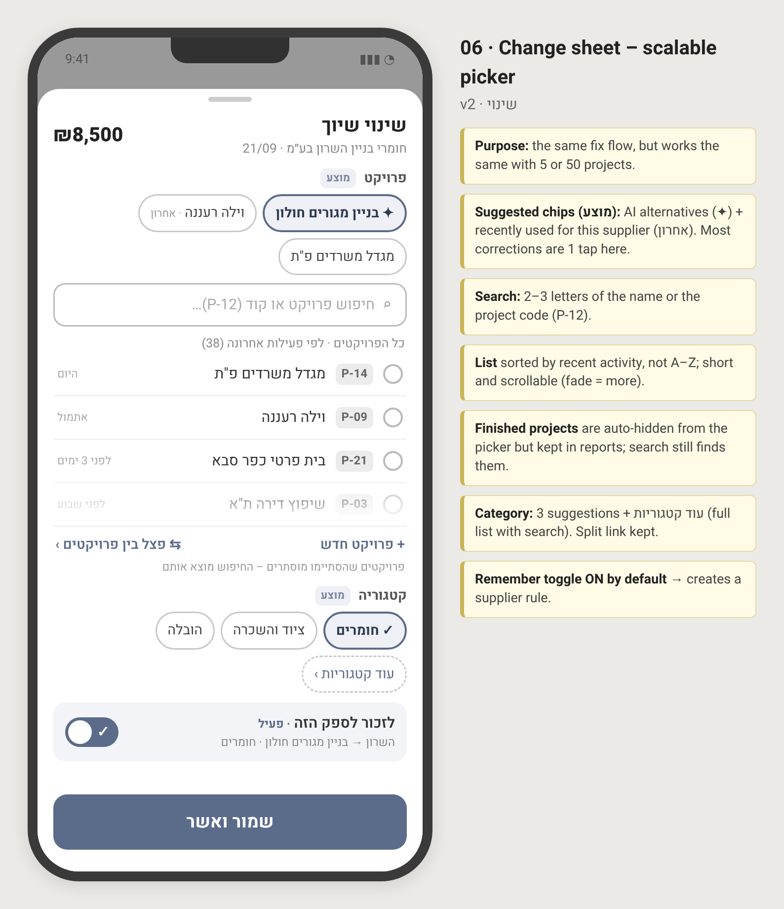

### Detailed spec: TODO

Fields, component states, empty states, loading and error states, and edge cases for this screen are not specified yet. In particular: search with no hits, creating a project inline, the split form (amount and percent, lines must sum to the transaction), choosing overhead, and the full category list behind `עוד קטגוריות`.

## 07-categories — Categories

**Status:** Approved.
**File:** [wireframes/07-categories.png](wireframes/07-categories.png)

### Purpose

Light category maintenance. The seven expense defaults and the two income defaults are already there. Most owners never need this screen. It is reached from Settings; the breadcrumb is `הגדרות`.

### Main elements

- Back button, breadcrumb `הגדרות`, title `קטגוריות`.
- Tabs `הוצאות` (selected) and `הכנסות`. The income tab holds `תקבול מלקוח` and `הכנסה אחרת`. The wireframe shows the expense tab.
- Drag handle, name, transaction count, and a `⋯` menu on each row:
  - `חומרים` 124 `תנועות`
  - `קבלני משנה` 38
  - `עבודה` 52
  - `ציוד והשכרה` 17
  - `הובלה` 21 (the menu is drawn open on this row)
  - `ביטוח` 4
  - `אחר` 9
- Collapsed row `מוסתרות (1)`.
- Dashed button `+ קטגוריה חדשה`.
- Open menu: `שנה שם`, `הסתר`, `מזג לקטגוריה אחרת`, and `מחק` disabled, with the note `מחיקה אפשרית רק לקטגוריה ללא תנועות`.
- Bottom nav with `הגדרות` active.

### Key interactions

- Drag the handle to reorder. The top of the list is what pickers prefer.
- Rename edits the label in place. Existing transactions keep the category and show the new name.
- Hide moves the category into `מוסתרות`. It leaves pickers and stays in history. The hidden group expands to restore.
- Merge asks for another category and moves this category's transactions onto it.
- Delete is enabled only at zero transactions. The example menu is on `הובלה`, which has 21, so delete is disabled.
- `+ קטגוריה חדשה` adds a row on the current tab (expense or income).
- The same create action exists inline on the change sheet, so an owner mid-review does not have to come here.

### Wireframe

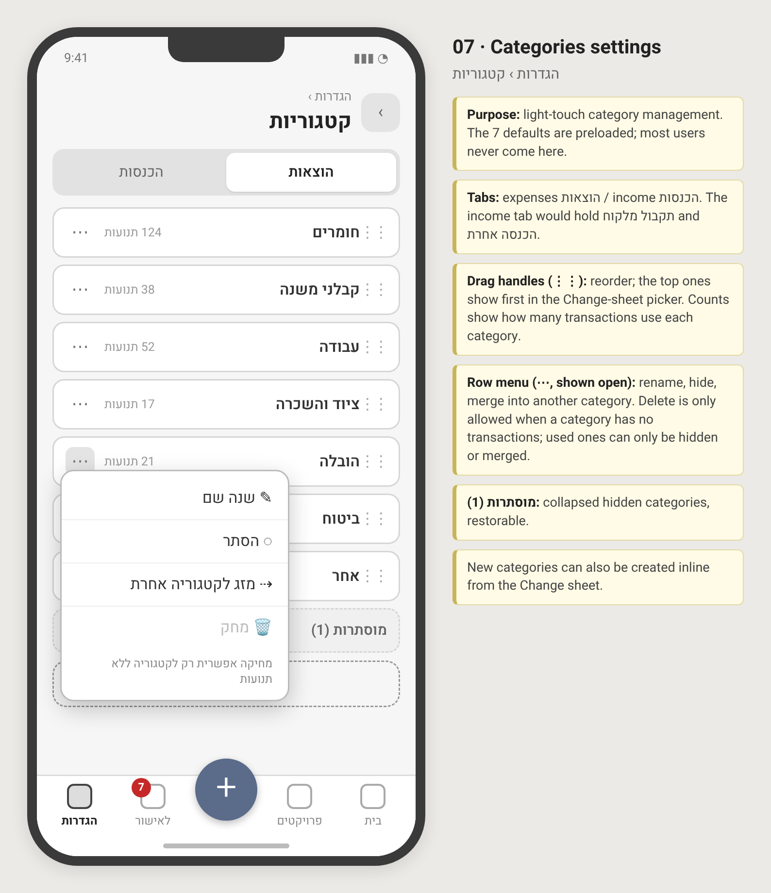

### Detailed spec: TODO

Fields, component states, empty states, loading and error states, and edge cases for this screen are not specified yet. In particular: the income tab, the merge picker, the rename field, the hint once there are more than about 15 categories, and restoring a hidden category.

## 08-upload-results — Statement upload results

**Status:** Approved.
**File:** [wireframes/08-upload-results.png](wireframes/08-upload-results.png)

### Purpose

Show what a statement file became, and send the owner only to the rows that need a decision. This is the screen after `העלה דוח בנק/אשראי`. The proof of concept parses a Bank Hapoalim (`בנק הפועלים`) file. [0012](../decisions/0012-bank-hapoalim-first.md).

### Main elements

- Title `דוח בנק הועלה`, file line with the example name `לאומי_ספטמבר.xlsx` and the range `01–30/09`, and a close button.
- Summary card: `42` and `שורות נקלטו`, plus a stacked bar.
- Four result rows. The example sums to 42:
  - 18 `הותאמו לחשבוניות קיימות` — `ספק + סכום + תאריך תואמים`
  - 15 `סווגו לפי כללים שלמדנו` — `ספקים שאישרת בעבר`
  - 2 `העברות בין חשבונות שלך` — `הוסרו – לא נספרות ברווח` (dimmed)
  - 7 `ממתינות לאישור` — `ה-AI הציע שיוך – צריך את האישור שלך` (this row is emphasized)
- Note: `3 חשבוניות עדיין לא שולמו – לא נספרות ברווח`.
- Primary button `לאשר 7 פריטים`.
- Secondary button `אשר את כל המסווגים (33)`. The 33 are the 18 invoice matches plus the 15 rule matches. The 2 transfers are not included; they were removed.
- Link `הצג את כל 42 השורות`.
- Bottom nav is present and no tab is marked active.

The file name `לאומי_ספטמבר.xlsx` is example art from before [0012](../decisions/0012-bank-hapoalim-first.md). The bank to support is Hapoalim, not Leumi.

### Key interactions

- `לאשר 7 פריטים` opens the review queue at the unmatched rows from this file. Those seven are the low-confidence rows.
- `אשר את כל המסווגים (33)` is drawn as a manual confirm of the 18 invoice matches plus the 15 rule matches. Under [0011](../decisions/0011-auto-approve-high-confidence.md) those 33 are auto-approved and skip the queue. This screen's job for them is a short summary, with a way to reopen any row. The summary layout is not a separate wireframe yet. The 2 transfers stay removed.
- The unpaid-invoice note opens the invoices that still have no payment. They stay out of P&L until a match or a cash "mark paid".
- `הצג את כל 42 השורות` opens the imported rows, including the removed transfers. That list is not wireframed.
- Close returns without forcing a decision. Unapproved rows stay suggested and stay in the pending count.

### Wireframe

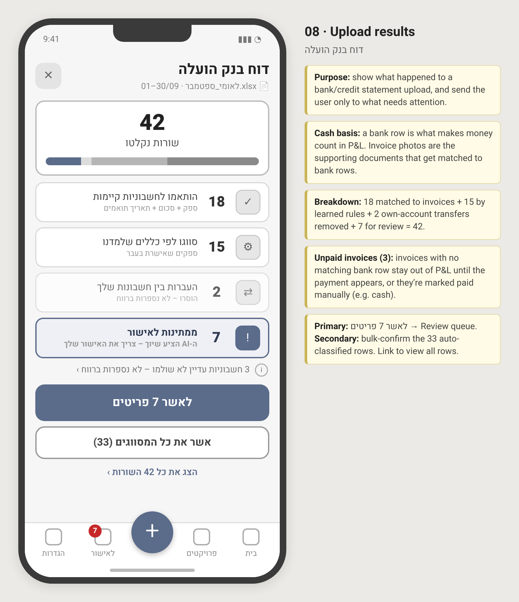

### Detailed spec: TODO

Fields, component states, empty states, loading and error states, and edge cases for this screen are not specified yet. In particular: a file with zero rows, a file the parser does not recognize, every row removed as a transfer, and the all-rows list.

## 01-home — Home, few projects

**Status:** Superseded by [01-home-v2](#01-home-v2). Kept for history. Do not build this layout. It does not scale past a short project list, and it has no sort and no collapsed "more projects" row.
**File:** [wireframes/01-home.png](wireframes/01-home.png)

### Purpose

The first Home: company profit for the period when the owner has only a few jobs, each drawn as a full row.

### Main elements

- `שלום, יוסי`, subtitle `סיכום החברה · ספטמבר 2026`, menu button.
- Period switch `החודש` / `מתחילת השנה`, with `החודש` selected.
- Tiles: `הכנסות` ₪420,000, `הוצאות` ₪330,000, `רווח/הפסד` ₪90,000.
- Banner `7 פריטים ממתינים לאישור`.
- Section `פרויקטים` with `הכל`.
- Full rows (name, profit, income and expense subtitle, bar):
  - `וילה רעננה`, ₪50,000, income ₪180,000, expenses ₪130,000
  - `בניין מגורים חולון`, ₪70,000, income ₪180,000, expenses ₪110,000
  - `שיפוץ דירה ת"א`, −₪10,000, income ₪60,000, expenses ₪70,000
- Dashed `הוצאות כלליות`, −₪20,000, caption `תקורה של החברה · לא משויך לפרויקט`.
- The same bottom nav as v2, `בית` active, badge `7` on `לאישור`.

Example check: income 180,000 + 180,000 + 60,000 = 420,000. Expenses 130,000 + 110,000 + 70,000 + overhead 20,000 = 330,000. Profit 90,000.

### Key interactions

Same as v2 for the period switch, the banner, a project row, overhead, and the center `+`. `הכל` opens the projects list. There is no top-5 cutoff and no losses-first sort. That is why v2 replaced it.

### Wireframe

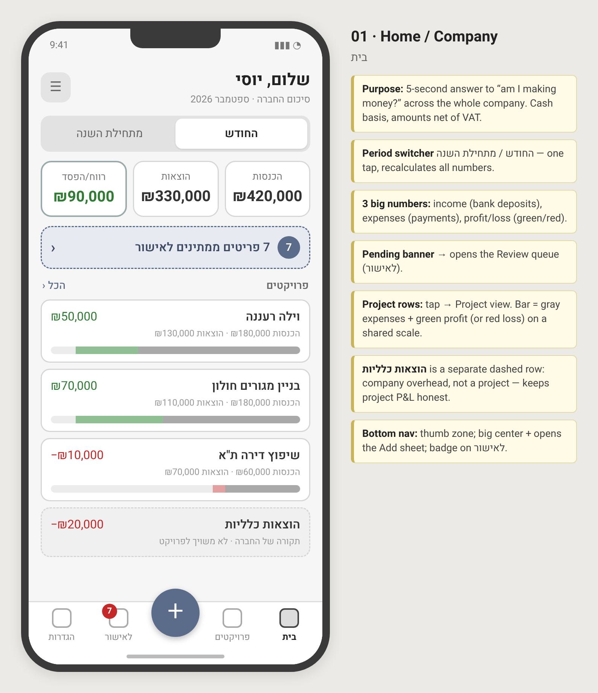

### Detailed spec: TODO

Not specified. This screen is superseded; write the detailed spec on [01-home-v2](#01-home-v2) instead.

## 06-change-sheet — Change sheet, all chips

**Status:** Superseded by [06-change-sheet-v2](#06-change-sheet-v2). Kept for history. Do not build this layout. A chip for every project and every category does not fit once the lists grow.
**File:** [wireframes/06-change-sheet.png](wireframes/06-change-sheet.png)

### Purpose

The first change sheet: fix project and category when both lists are short enough to show as chips.

### Main elements

Drawn over the review card.

- Title `שינוי שיוך`, context `חומרי בניין השרון בע״מ · 21/09`, amount ₪8,500.
- `פרויקט` chips: `וילה רעננה`, `בניין מגורים חולון` (selected), `שיפוץ דירה ת"א`, `הוצאות כלליות`, `+ פרויקט חדש`.
- Link `פצל בין פרויקטים`.
- `קטגוריה` chips: `חומרים` (selected), `קבלני משנה`, `עבודה`, `ציוד והשכרה`, `הובלה`, `ביטוח`, `אחר`, `+ קטגוריה חדשה`.
- Remember row, toggle on: `לזכור לספק הזה`, preview `חומרי בניין השרון → חולון · חומרים`.
- `שמור ואשר`.

The selected project (`בניין מגורים חולון`) differs from the AI chip on the card behind it (`וילה רעננה`). The sheet shows a correction in progress. Overhead is a chip of its own on this version; on the v2 sheet it is reached through search and the list, because finished and special rows are not all pinned as chips.

### Key interactions

Select one project chip and one category chip, leave the remember toggle on, and save. `+ פרויקט חדש` and `+ קטגוריה חדשה` create inline. Split works as on v2. v2 replaces the full chip sets with three suggestions, search, and a list.

### Wireframe

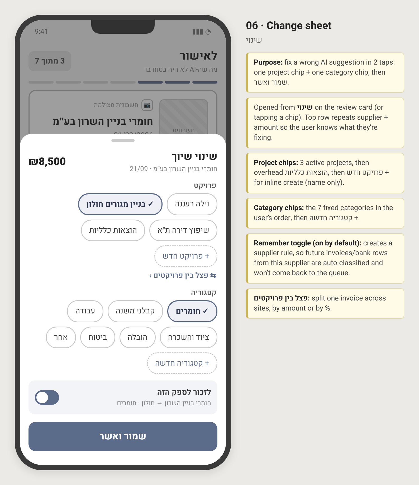

### Detailed spec: TODO

Not specified. This screen is superseded; write the detailed spec on [06-change-sheet-v2](#06-change-sheet-v2) instead.

## overview — Board of screens 01–05

**Status:** Approved composite. The Home phone on this board is the superseded [01-home](#01-home). The other four phones match the approved screens.
**File:** [wireframes/overview.png](wireframes/overview.png)

### Purpose

One picture of the first five screens, in order, for design review.

### Main elements

A header line `Construction P&L – mobile POC · Hebrew RTL · 390×844` and a label `Example data · low-fi wireframe · POC`. Five phones, each with a one-line caption under it:

1. Home / Company (`בית`) — the superseded three-project Home.
2. Project view (`פרויקט`) — `וילה רעננה`.
3. Review queue (`לאישור`).
4. Add sheet (`הוספה`) over Home.
5. Projects list (`פרויקטים`) with the create sheet open.

### Key interactions

None. This file is a board, not a screen.

### Wireframe

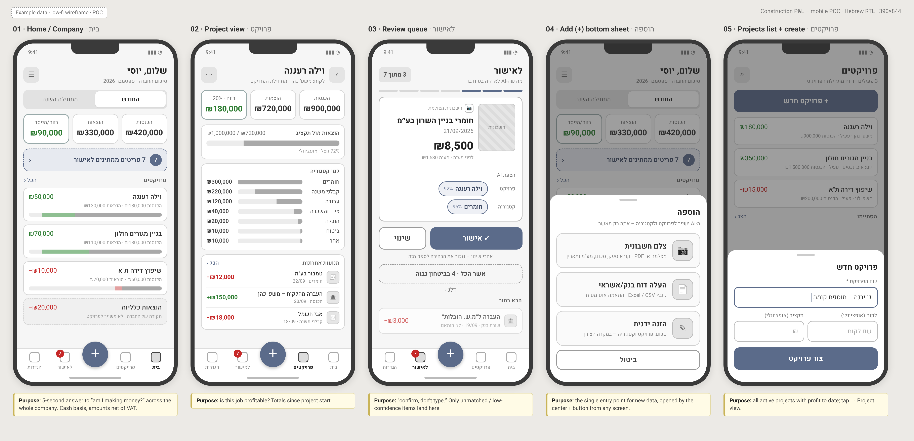

### Detailed spec: TODO

Not a product screen. Specs belong on the individual screens. The Home shown here is superseded.

## overview-2 — Board of screens 06–08

**Status:** Approved composite. The change-sheet phone is the superseded [06-change-sheet](#06-change-sheet). Categories and upload results match the approved screens.
**File:** [wireframes/overview-2.png](wireframes/overview-2.png)

### Purpose

One picture of the second batch: change sheet, categories, and upload results.

### Main elements

Labeled `Example data · low-fi wireframe · POC · part 2`, with the same product header as the first board. Three phones:

1. Change sheet (`שינוי`) — the superseded all-chips sheet, over the review card.
2. Categories (`הגדרות › קטגוריות`) — expense list with the row menu open.
3. Upload results (`דוח בנק הועלה`).

### Key interactions

None. This file is a board, not a screen.

### Wireframe

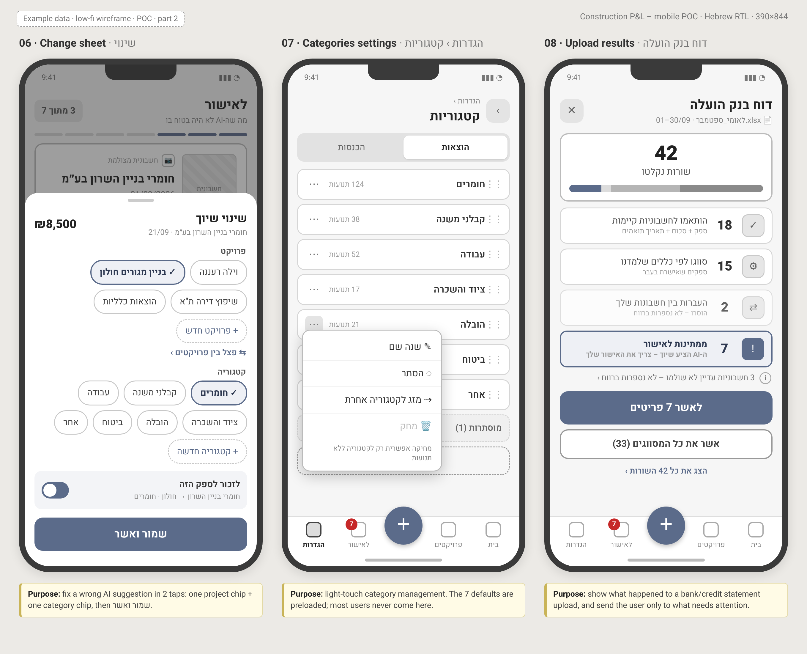

### Detailed spec: TODO

Not a product screen. The change sheet shown here is superseded by [06-change-sheet-v2](#06-change-sheet-v2).

## overview-3 — Board of the v2 screens

**Status:** Approved composite. Both phones are current.
**File:** [wireframes/overview-3.png](wireframes/overview-3.png)

### Purpose

One picture of the two screens that replaced the short-list layouts: Home with many projects, and the change sheet with suggested chips, search, and a list.

### Main elements

Labeled `Example data · low-fi wireframe · v2 (~40 projects)`. Two phones:

1. `01-home-v2` — top 5, twelve more collapsed, overhead, company tiles at ₪1,310,000 / ₪1,110,000 / ₪200,000.
2. `06-change-sheet-v2` — three project chips, search, activity list, three category chips, remember toggle on.

The "~40 projects" label is the annotation's round number. The sheet's list header says 38, and Home's subtitle says 17 active this month. Those are example figures on the two screens, not a second spec.

### Key interactions

None. This file is a board, not a screen.

### Wireframe

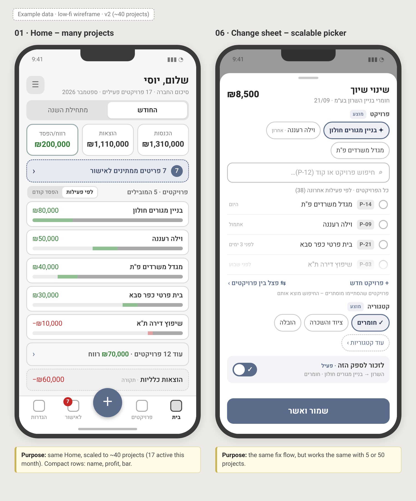

### Detailed spec: TODO

Not a product screen. Specs belong on [01-home-v2](#01-home-v2) and [06-change-sheet-v2](#06-change-sheet-v2).
