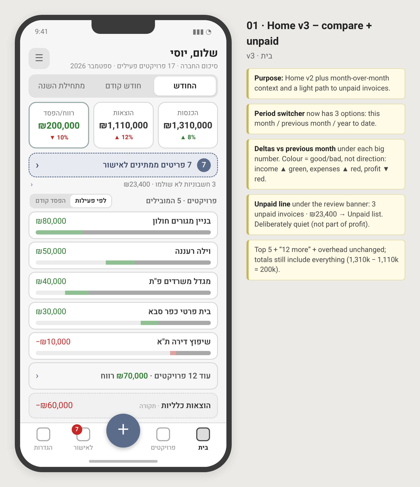
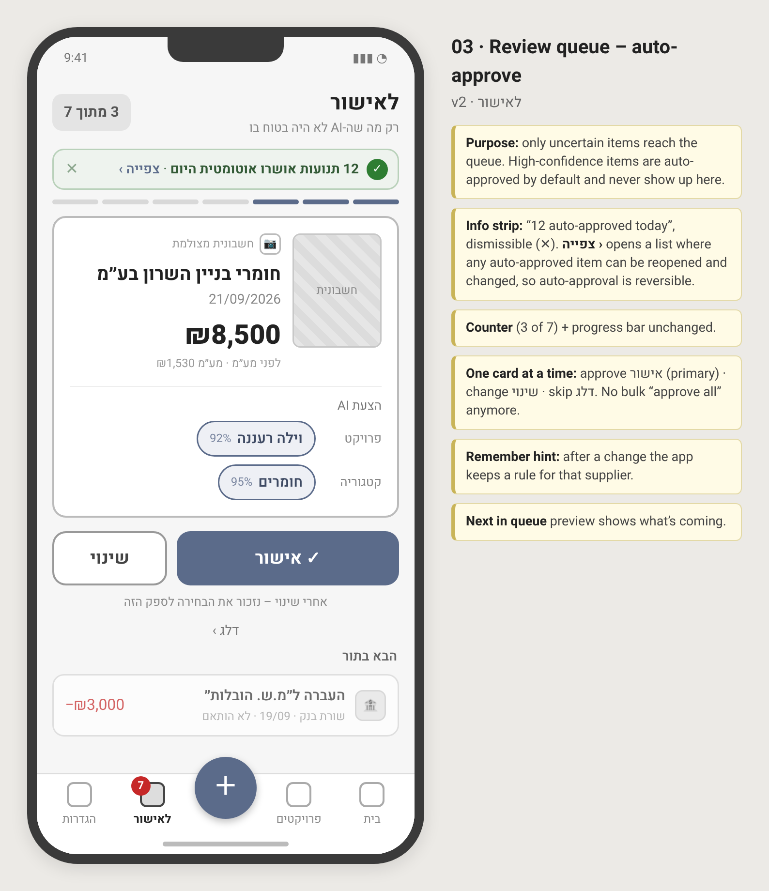
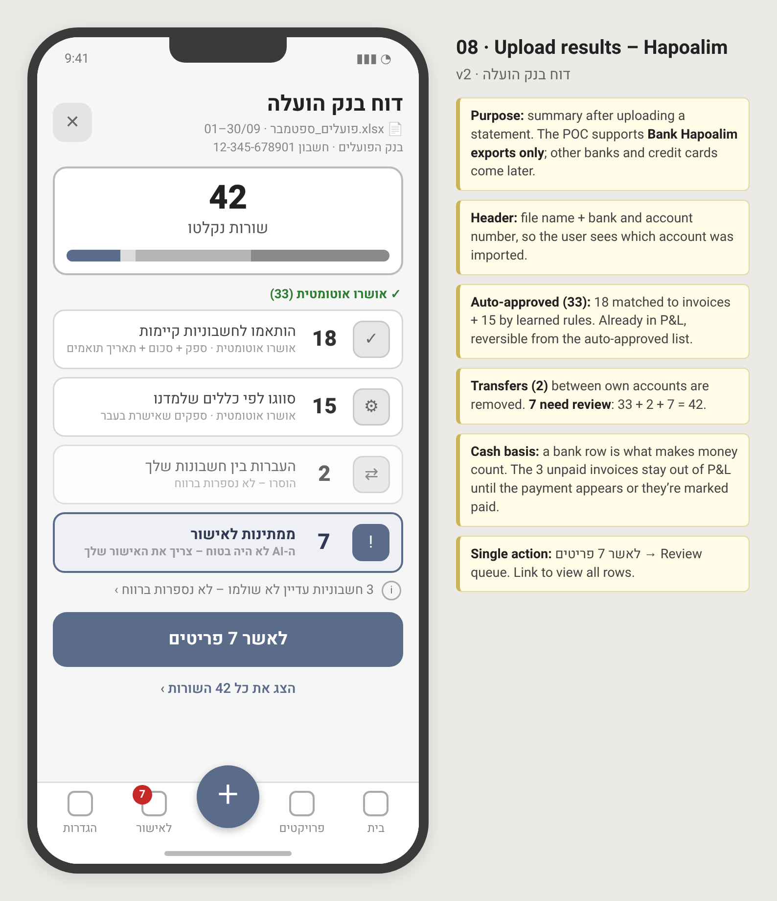
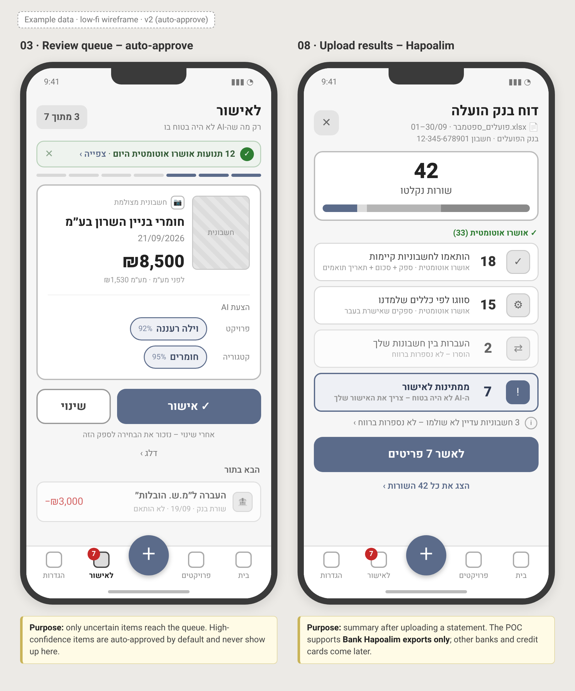
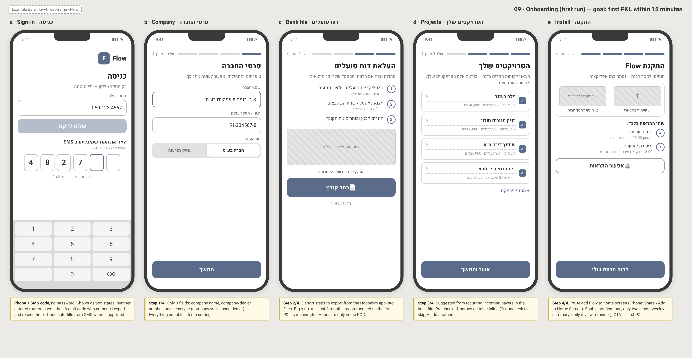
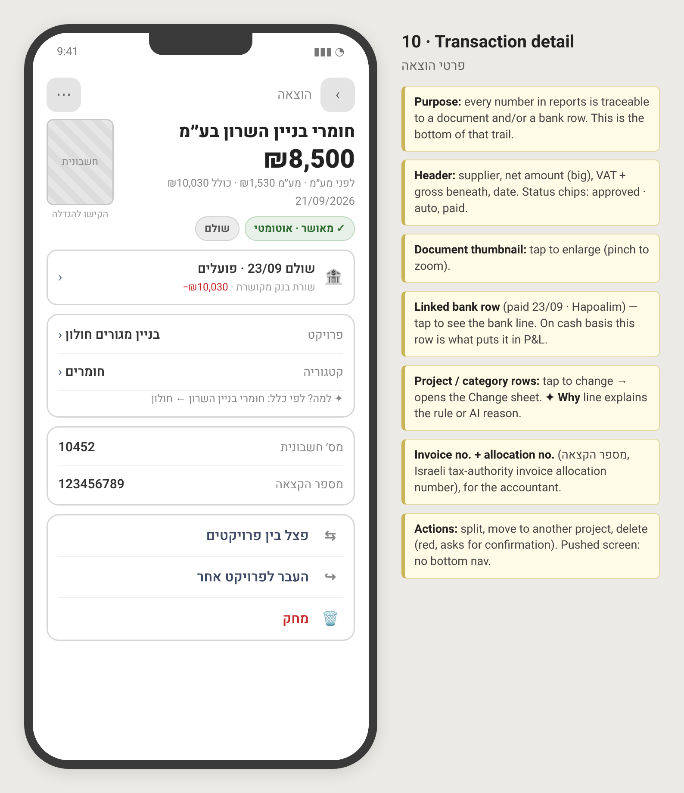
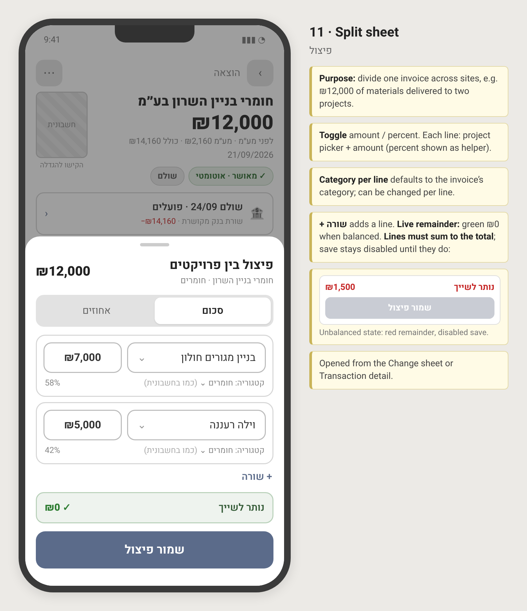
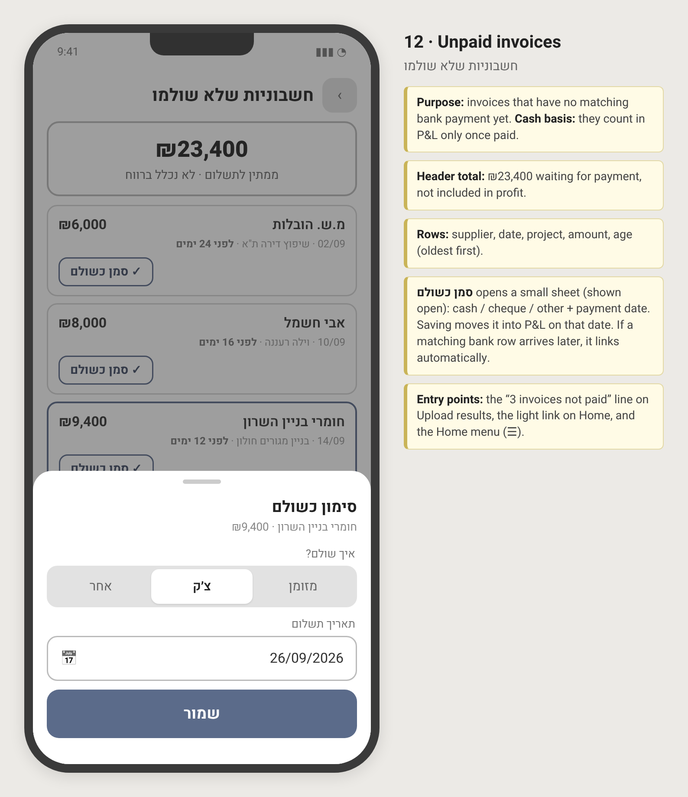
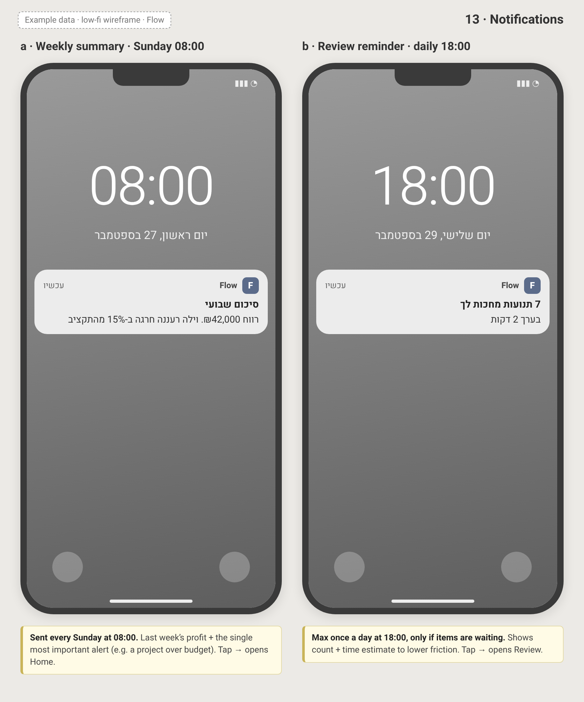
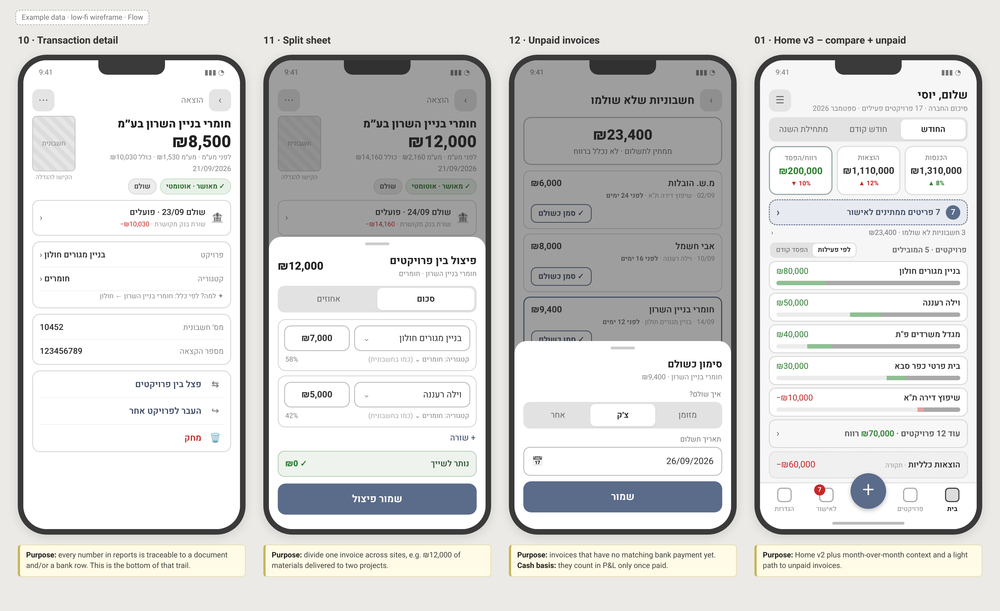

# Flow — Module 1 screens

Each section is one wireframe. The detailed spec for each product screen is a separate file, linked below. Figures in the wireframes are example data for September 2026, not a real company. Numbers follow [calculations](calculations.md). Two example companies appear: screens from the first pass use three projects, and the v2 Home uses a larger company (17 active projects this month). Do not expect the month totals on Home to equal the lifetime totals on a project screen. Home is this month, last month, or year to date. The project screen is since the job started.

The phone UI is Hebrew only, right to left. Profit is green, loss is red, and a negative amount uses a minus sign. Income and expense totals on the summary tiles are neutral. The English notes beside the phone in the PNG are annotations for design review. They are not in the product.

Build the approved screens. Superseded screens are kept below and marked. [01-home-v3](#01-home-v3) and screens 09–13 are drawn and **pending owner approval**. Until that approval, do not treat a difference between those images and an accepted decision as a change to the decision.

| Build this | Wireframe notes | Detailed spec |
| --- | --- | --- |
| Home | [01-home-v3](#01-home-v3), pending approval. Supersedes [01-home-v2](#01-home-v2). | [screens/01-home.md](screens/01-home.md) |
| Project | [02-project](#02-project) | [screens/02-project.md](screens/02-project.md) |
| Review | [03-review-v2](#03-review-v2) | [screens/03-review.md](screens/03-review.md) |
| Add | [04-add](#04-add) | [screens/04-add.md](screens/04-add.md) |
| Projects | [05-projects](#05-projects) | [screens/05-projects.md](screens/05-projects.md) |
| Change sheet | [06-change-sheet-v2](#06-change-sheet-v2) | [screens/06-change-sheet.md](screens/06-change-sheet.md) |
| Categories | [07-categories](#07-categories) | [screens/07-categories.md](screens/07-categories.md) |
| Upload results | [08-upload-results-v2](#08-upload-results-v2) | [screens/08-upload-results.md](screens/08-upload-results.md) |

`הגדרות` (Settings) is a tab in the bottom bar. Its screen is not wireframed. See [open questions](../open-questions.md).

| Pending owner approval | Section |
| --- | --- |
| First-run onboarding | [09-onboarding](#09-onboarding) |
| Transaction detail | [10-transaction-detail](#10-transaction-detail) |
| Split sheet | [11-split](#11-split) |
| Unpaid invoices | [12-unpaid](#12-unpaid) |
| Notifications | [13-notifications](#13-notifications) |

Behavior that these screens illustrate is specified in [spec.md](spec.md).

## 01-home-v3 — Home, three periods and unpaid

**Status:** Pending owner approval. This is the Home image that matches [0019](../decisions/0019-home-periods-and-comparison.md).
**Supersedes:** [01-home-v2](#01-home-v2).
**File:** [wireframes/01-home-v3.png](wireframes/01-home-v3.png)

### Purpose

The same company answer as Home v2, plus how this month compares with the previous month, and a quiet path to invoices that are not in the profit yet.

### Main elements

- Greeting `שלום, יוסי` and the line `סיכום החברה · 17 פרויקטים פעילים · ספטמבר 2026`. Menu button `☰`.
- Period switch: `החודש` (selected), `חודש קודם`, `מתחילת השנה`.
- Three tiles, with an example comparison under each. Color means whether the change helps, not whether the arrow points up.
  - `הכנסות` ₪1,310,000, `▲ 8%` in green.
  - `הוצאות` ₪1,110,000, `▲ 12%` in red.
  - `רווח/הפסד` ₪200,000 in green, `▼ 10%` in red. The profit tile is emphasized.
- Pending banner: badge `7` and `7 פריטים ממתינים לאישור`.
- Under the banner, a quiet line: `3 חשבוניות לא שולמו · ₪23,400`. It is not part of the tiles.
- Section `פרויקטים · 5 המובילים` and sort pill `לפי פעילות` / `הפסד קודם`.
- The same five rows, collapsed `עוד 12 פרויקטים · ₪70,000 רווח`, and dashed overhead `הוצאות כלליות · תקורה` −₪60,000, as on [01-home-v2](#01-home-v2).
- Bottom nav: `בית` (active), `פרויקטים`, center `+`, `לאישור` with badge `7`, `הגדרות`.

The 8%, 12%, and 10% figures are example data on this image. The formula is in [calculations](calculations.md#comparison-arrow). The tile arithmetic is unchanged from v2: 1,310,000 − 1,110,000 = 200,000.

### Key interactions

- The period switch recalculates the tiles, the comparison, the top 5, the collapsed profit, and overhead. This month compares with the previous calendar month. Last month compares with the month before that. Year to date shows no arrow until [that baseline](../open-questions.md#year-to-date-comparison) is decided. The image draws this month selected.
- The unpaid line opens [unpaid invoices](#12-unpaid). It does not change the tiles.
- The pending banner opens review. Project rows, the collapsed row, overhead, the sort pill, and `+` behave as on v2.

### States

**Loading, empty, error, and offline** are the Home states in [screens/01-home.md](screens/01-home.md). The unpaid line is hidden when the unpaid count is 0. The comparison is hidden on year to date, and hidden on a tile whose baseline and current total are both 0.

**Partial.** Banner when suggested rows exist. Unpaid line when unpaid documents exist. The two are independent. A company can have one, both, or neither.

### Edge cases

- **Expenses up.** A red up-arrow, as drawn (`▲ 12%`). An expense decrease is green.
- **Profit down while still positive.** The profit amount stays green. The comparison under it is red, as drawn (`▼ 10%`).
- **Unpaid total.** The ₪23,400 on this image is the sum of the three rows on the unpaid list. It is net of VAT and is not added to expenses.
- **Year to date.** No arrow on that segment until the open baseline is decided. The image does not draw year to date selected.

### Acceptance criteria

- [ ] The switch has `החודש`, `חודש קודם`, and `מתחילת השנה`.
- [ ] This month and last month show the comparison on all three tiles. Green and red follow whether the change helps.
- [ ] Year to date shows the three totals and no arrow.
- [ ] The unpaid line shows the count and the net total, opens the unpaid list, and is absent from profit.
- [ ] The v2 checks in [Home](screens/01-home.md) still hold: top 5, overhead last, suggested rows only in the banner.

### Wireframe

### Detailed spec

[Home](screens/01-home.md). `☰` opens the [Settings draft](settings.md), which is not approved. The unpaid wireframe also names `☰` as a way into the unpaid list; what that button opens is still [open](../open-questions.md#settings-screen).

## 01-home-v2 — Home, many projects

**Status:** Superseded by [01-home-v3](#01-home-v3).
**Supersedes:** [01-home](#01-home).
**File:** [wireframes/01-home-v2.png](wireframes/01-home-v2.png)

### Purpose

The same company answer as the first Home — "am I making money this period?" — when the business has too many jobs to list. Company totals include every project and overhead. The list shows only where to look next.

### Main elements

- Greeting `שלום, יוסי` and the line `סיכום החברה · 17 פרויקטים פעילים · ספטמבר 2026`. A menu button (`☰`) sits at the end of the top bar. What it opens is not specified.
- Period switch on this image: `החודש` (selected) and `מתחילת השנה`. No comparison arrows and no unpaid line. Those are on [01-home-v3](#01-home-v3).
- Three tiles: `הכנסות` ₪1,310,000, `הוצאות` ₪1,110,000, `רווח/הפסד` ₪200,000 in green. The profit tile is emphasized.
- Pending banner: a count badge `7` and `7 פריטים ממתינים לאישור`, with a chevron.
- Section `פרויקטים · 5 המובילים` and a sort pill: `לפי פעילות` (selected) and `הפסד קודם`.
- Five compact rows. Each row is a name, the profit or loss, and a bar (gray expenses, green profit, or red loss). There is no income/expense subtitle on the row.
  - `בניין מגורים חולון` ₪80,000
  - `וילה רעננה` ₪50,000
  - `מגדל משרדים פ"ת` ₪40,000
  - `בית פרטי כפר סבא` ₪30,000
  - `שיפוץ דירה ת"א` −₪10,000
- Collapsed row: `עוד 12 פרויקטים · ₪70,000 רווח`.
- Dashed overhead row: `הוצאות כלליות · תקורה`, −₪60,000.
- Bottom nav: `בית` (active), `פרויקטים`, center `+`, `לאישור` with badge `7`, `הגדרות`.

The example arithmetic, so the tiles can be checked against the rows: top-5 income 910,000 plus the other 12 at 400,000 is 1,310,000. Top-5 expenses 720,000 plus the other 12 at 330,000 plus overhead 60,000 is 1,110,000. Profit is 200,000. The collapsed row's ₪70,000 is 400,000 − 330,000. The on-screen top 5 do not add up to the company profit, and they are not supposed to.

### Key interactions

- The period switch recalculates the tiles, the top 5, the collapsed profit, and overhead.
- The sort pill rebuilds the top 5. `לפי פעילות` is the most cash movement this month. `הפסד קודם` surfaces losing jobs. Overhead stays the last row. The rest stay collapsed.
- Tapping a project row opens that project. Tapping the collapsed row opens the projects list. Tapping overhead opens the overhead view (company costs that are not a job).
- The pending banner opens the review queue.
- The center `+` opens the add sheet from any tab.

### Wireframe

### Detailed spec

[Home](screens/01-home.md). `☰` opens the [Settings draft](settings.md), which is not approved.

## 02-project — Project

**Status:** Approved.
**File:** [wireframes/02-project.png](wireframes/02-project.png)

### Purpose

Answer "is this job profitable?" for one project, from the day it started, and show where the expenses went.

### Main elements

- Back button, title `וילה רעננה`, subtitle `לקוח: משפ׳ כהן · מתחילת הפרויקט`, and a `⋯` menu.
- Three tiles: `הכנסות` ₪900,000, `הוצאות` ₪720,000, `רווח · 20%` ₪180,000. Margin is profit divided by income (180,000 / 900,000).
- Budget card `הוצאות מול תקציב`: ₪720,000 / ₪1,000,000, a bar filled to 72%, caption `72% נוצל · אופציונלי`. The card is on this screen because the example job has a budget. [0014](../decisions/0014-optional-project-budget.md): budget is optional, and this card appears only when a budget is set.
- `לפי קטגוריה`: one bar per expense category, scaled to the largest bar. The example sums to the expenses tile: `חומרים` ₪300,000, `קבלני משנה` ₪220,000, `עבודה` ₪120,000, `ציוד והשכרה` ₪40,000, `הובלה` ₪20,000, `ביטוח` ₪10,000, `אחר` ₪10,000.
- `תנועות אחרונות` with an "all" chevron (`הכל`). Three example rows, source mark plus signed amount:
  - Invoice, `טמבור בע"מ`, `חומרים · 22/09`, −₪12,000
  - Bank, `העברה מהלקוח – משפ׳ כהן`, `הכנסה · 20/09`, +₪150,000
  - Invoice, `אבי חשמל`, `קבלני משנה · 18/09`, −₪18,000
- Bottom nav with `פרויקטים` active.

### Key interactions

- Back returns to the list or Home, whichever opened the project.
- The `⋯` menu, from the annotation on this wireframe: edit name, client, and budget, and close the project (status becomes finished).
- Tapping a category focuses that category's transactions. Tapping a transaction opens it for a project or category change (the change sheet).
- `הכל` opens the full transaction list for the project. That list is not a separate wireframe yet.

### Wireframe

### Detailed spec

[Project](screens/02-project.md). Overhead reuses this layout. The budget card is omitted when no budget is set.

## 03-review-v2 — Review queue

**Status:** Approved. This is the review queue to build.
**Supersedes:** [03-review](#03-review).
**File:** [wireframes/03-review-v2.png](wireframes/03-review-v2.png)

### Purpose

Confirm what Flow did not auto-approve. One card at a time. Rows that already matched an invoice or a supplier rule stay out of the card and show as a strip the owner can open.

### Main elements

- Title `לאישור`, subtitle `מה שה-AI לא היה בטוח בו`.
- Strip `12 אושרו אוטומטית` with `הצג`, separated from the queue by a light rule.
- Position pill `3 מתוך 7` and a seven-segment progress bar with three segments filled.
- One card:
  - A thumbnail placeholder labeled `חשבונית`.
  - Source line `חשבונית מצולמת` with a camera mark.
  - Supplier `חומרי בניין השרון בע״מ`, date `21/09/2026`.
  - Net amount ₪8,500, and under it `לפני מע״מ · מע״מ ₪1,530` (the example VAT is 18% of the net).
  - `הצעת AI`: project chip `וילה רעננה` at 92%, category chip `חומרים` at 95%.
- Primary button `אישור` (with a check) and secondary button `שינוי`.
- Caption `אחרי שינוי – נזכור את הבחירה לספק הזה`.
- Text button `דלג`. There is no `אשר הכל` button.
- `הבא בתור`: a dimmed bank row, `העברה ל״מ.ש. הובלות״`, `שורת בנק · 19/09 · לא הותאם`, −₪3,000.
- Bottom nav with `לאישור` active and badge `7`.

### Key interactions

- `הצג` on the auto-approved strip opens that list. A row there can be reopened in the change sheet.
- `אישור` accepts the chips, marks the transaction approved, and brings the next card up.
- `שינוי`, or tapping a chip, opens the change sheet ([06-change-sheet-v2](#06-change-sheet-v2)).
- `דלג` parks the card and moves on. The item stays suggested and out of reports.
- The thumbnail opens the document larger. That viewer is not wireframed.
- The dimmed "next" row is a preview, not a second set of actions.

### Wireframe

### Detailed spec

[Review queue](screens/03-review.md).

## 03-review — Review queue, with Approve all

**Status:** Superseded by [03-review-v2](#03-review-v2). Kept for history. Do not build this layout. It includes a bulk `אשר הכל` button for high-confidence items, which now auto-approve and skip this card.
**File:** [wireframes/03-review.png](wireframes/03-review.png)

### Purpose

The first review queue: one card, plus a dashed bulk action for high-confidence items.

### Main elements

- Title `לאישור`, subtitle `מה שה-AI לא היה בטוח בו`.
- Position pill `3 מתוך 7` and a seven-segment progress bar with three segments filled.
- The same invoice card as v2: `חומרי בניין השרון בע״מ`, `21/09/2026`, ₪8,500 net, VAT ₪1,530, chips `וילה רעננה` 92% and `חומרים` 95%.
- Buttons `אישור` and `שינוי`, caption `אחרי שינוי – נזכור את הבחירה לספק הזה`.
- Dashed button `אשר הכל · 4 בביטחון גבוה`.
- `דלג`, then `הבא בתור` with the bank row `העברה ל״מ.ש. הובלות״`, −₪3,000.
- Bottom nav with `לאישור` active and badge `7`. There is no auto-approved strip.

### Key interactions

`אישור`, `שינוי`, and `דלג` match v2. `אשר הכל` was the bulk confirm this version replaced.

### Wireframe

### Detailed spec

Do not build this screen. The spec to build is [Review queue](screens/03-review.md), against [03-review-v2](#03-review-v2).

## 04-add — Add sheet

**Status:** Approved.
**File:** [wireframes/04-add.png](wireframes/04-add.png)

### Purpose

The only way to bring new data in. The center `+` opens this sheet on top of whatever screen the owner was on. The wireframe draws it over Home.

### Main elements

- Scrim over the screen behind.
- Sheet title `הוספה`.
- Subtitle `ה-AI ישייך לפרויקט ולקטגוריה – אתה רק מאשר`.
- Three large rows:
  - `צלם חשבונית` — `מצלמה או PDF · קורא ספק, סכום, מע״מ ותאריך`
  - `העלה דוח בנק/אשראי` — `קובץ Excel / CSV · התאמה אוטומטית`
  - `הזנה ידנית` — `סכום, פרויקט וקטגוריה – במקרה הצורך`
- `ביטול`.

### Key interactions

- `צלם חשבונית` takes several photos in a row, or picks a PDF or image already on the phone. [0020](../decisions/0020-capture-from-the-phone.md). The image still labels the row `מצלמה או PDF`. After extraction, the document enters matching and, if it is not high confidence, the review queue. An installed Android app can also receive an image or PDF from the system share sheet. iPhone cannot, and this sheet does not offer that.
- `העלה דוח בנק/אשראי` picks an Excel or CSV file and then shows [upload results](#08-upload-results-v2). In the proof of concept that file is a Bank Hapoalim (`בנק הפועלים`) statement. [0012](../decisions/0012-bank-hapoalim-first.md). The label still mentions credit (`אשראי`); credit-card company files are later.
- `הזנה ידנית` is the cash and cheque fallback. The form itself is not wireframed.
- `ביטול`, or tapping the scrim, closes the sheet and leaves the data unchanged.

### Wireframe

### Detailed spec

[Add sheet](screens/04-add.md), including the manual-entry form, unreadable photos, and rejected files.

## 05-projects — Projects list and create

**Status:** Approved.
**File:** [wireframes/05-projects.png](wireframes/05-projects.png)

### Purpose

Every active project, with profit since the job started, and a short form to add one. The wireframe shows the create sheet already open over the list so both states are in one picture. In the product the sheet opens when the owner taps `+ פרויקט חדש`.

### Main elements

List, behind the sheet:

- Title `פרויקטים`, subtitle `3 פעילים · רווח מתחילת הפרויקט`, search button.
- Primary button `+ פרויקט חדש`.
- `וילה רעננה`, profit ₪180,000, `משפ׳ כהן · פעיל · הכנסות ₪900,000`.
- `בניין מגורים חולון`, profit ₪350,000, `יזם: א.ב. נכסים · פעיל · הכנסות ₪1,500,000`.
- `שיפוץ דירה ת"א`, loss −₪15,000, `משפ׳ לוי · פעיל · הכנסות ₪200,000`.
- Collapsed finished group: `הסתיימו` with `הצג`.
- Bottom nav with `פרויקטים` active.

Create sheet, in front:

- Title `פרויקט חדש`.
- `שם הפרויקט` (required), focused, example text `גן יבנה – תוספת קומה`.
- `לקוח (אופציונלי)`, placeholder `שם לקוח`.
- `תקציב (אופציונלי)`, placeholder `₪`.
- `צור פרויקט`.

### Key interactions

- A project row opens [the project screen](#02-project).
- Search (`⌕`) finds a job by name when the list is long. Finished jobs are included in search; they stay collapsed until `הצג`.
- `צור פרויקט` requires a name. Client and budget can be left empty and filled later from the project menu.
- The sheet dismisses the same way as Add: cancel or scrim. The wireframe does not draw a cancel button on this sheet.

### Wireframe

### Detailed spec

[Projects list and create](screens/05-projects.md). Codes are assigned as `P-01`, `P-02`, and are not typed.

## 06-change-sheet-v2 — Change sheet, scalable picker

**Status:** Approved. This is the change sheet to build.
**Supersedes:** [06-change-sheet](#06-change-sheet).
**File:** [wireframes/06-change-sheet-v2.png](wireframes/06-change-sheet-v2.png)

### Purpose

Fix a suggestion in two taps when there are many projects and many categories: one project, one category, then save. The sheet is drawn over the review card.

### Main elements

- Grabber, title `שינוי שיוך`, context `חומרי בניין השרון בע״מ · 21/09`, amount ₪8,500.
- `פרויקט` with a `מוצע` tag.
- Three chips: `בניין מגורים חולון` (selected, marked as the suggestion), `וילה רעננה · אחרון` (last used for this supplier), `מגדל משרדים פ"ת`.
- Search field `חיפוש פרויקט או קוד (P-12)…`.
- List header `כל הפרויקטים · לפי פעילות אחרונה (38)`.
- Rows with an empty radio, a code, a name, and how recently the job was used: `P-14` `מגדל משרדים פ"ת` `היום`; `P-09` `וילה רעננה` `אתמול`; `P-21` `בית פרטי כפר סבא` `לפני 3 ימים`; `P-03` `שיפוץ דירה ת"א` `לפני שבוע`; `P-17` `גן יבנה – תוספת קומה` fading out at the bottom of the list.
- `+ פרויקט חדש` and `פצל בין פרויקטים`.
- Caption `פרויקטים שהסתיימו מוסתרים – החיפוש מוצא אותם`.
- `קטגוריה` with a `מוצע` tag.
- Chips: `חומרים` (selected), `ציוד והשכרה`, `הובלה`, and `עוד קטגוריות`.
- Remember row, toggle on, labeled `לזכור לספק הזה · פעיל`, preview `השרון → בניין מגורים חולון · חומרים`.
- Primary button `שמור ואשר`.

The review card behind the sheet still shows the earlier suggestion (`וילה רעננה` at 92%). The sheet is the picker demo on top of that card. Treat the sheet's own chips as the layout to build.

### Key interactions

- A suggested chip selects that project or category. Most corrections end here.
- Search filters by name or by code. Typing a finished project's name or code reveals it even though the default list hides finished work.
- The activity list is the rest of the projects, most recently used first, not A–Z.
- `+ פרויקט חדש` creates a project without leaving the sheet (name only, same idea as the projects create sheet).
- `פצל בין פרויקטים` opens the [split sheet](#11-split). That sheet is pending owner approval. Until it is approved, a split still uses one category for every line ([calculations](calculations.md#splits)).
- `עוד קטגוריות` opens the full category list with search.
- The remember toggle defaults to on and writes the rule shown in the preview. Turning it off approves this row only.
- `שמור ואשר` stores the choice, writes the rule if the toggle is on, approves the transaction, and returns to the next review card.

### Wireframe

### Detailed spec

[Change sheet](screens/06-change-sheet.md), including search, inline create, overhead, and the split form. Split lines must sum to the parent net in agorot.

## 07-categories — Categories

**Status:** Approved.
**File:** [wireframes/07-categories.png](wireframes/07-categories.png)

### Purpose

Light category maintenance. The seven expense defaults and the two income defaults are already there. Most owners never need this screen. It is reached from Settings; the breadcrumb is `הגדרות`.

### Main elements

- Back button, breadcrumb `הגדרות`, title `קטגוריות`.
- Tabs `הוצאות` (selected) and `הכנסות`. The income tab holds `תקבול מלקוח` and `הכנסה אחרת`. The wireframe shows the expense tab.
- Drag handle, name, transaction count, and a `⋯` menu on each row:
  - `חומרים` 124 `תנועות`
  - `קבלני משנה` 38
  - `עבודה` 52
  - `ציוד והשכרה` 17
  - `הובלה` 21 (the menu is drawn open on this row)
  - `ביטוח` 4
  - `אחר` 9
- Collapsed row `מוסתרות (1)`.
- Dashed button `+ קטגוריה חדשה`.
- Open menu: `שנה שם`, `הסתר`, `מזג לקטגוריה אחרת`, and `מחק` disabled, with the note `מחיקה אפשרית רק לקטגוריה ללא תנועות`.
- Bottom nav with `הגדרות` active.

### Key interactions

- Drag the handle to reorder. The top of the list is what pickers prefer.
- Rename edits the label in place. Existing transactions keep the category and show the new name.
- Hide moves the category into `מוסתרות`. It leaves pickers and stays in history. The hidden group expands to restore.
- Merge asks for another category and moves this category's transactions onto it.
- Delete is enabled only at zero transactions. The example menu is on `הובלה`, which has 21, so delete is disabled.
- `+ קטגוריה חדשה` adds a row on the current tab (expense or income).
- The same create action exists inline on the change sheet, so an owner mid-review does not have to come here.

### Wireframe

### Detailed spec

[Categories](screens/07-categories.md).

## 08-upload-results-v2 — Statement upload results

**Status:** Approved. This is the upload summary to build.
**Supersedes:** [08-upload-results](#08-upload-results).
**File:** [wireframes/08-upload-results-v2.png](wireframes/08-upload-results-v2.png)

### Purpose

Show what a Bank Hapoalim file became. High-confidence rows are already approved. The owner is sent only to the rows that still need a decision.

### Main elements

- Title `דוח בנק הועלה`, file line `הפועלים_ספטמבר.xlsx` and the range `01–30/09`, and a close button.
- Summary card: `42` and `שורות נקלטו`, plus a stacked bar.
- Collapsed group `33 אושרו אוטומטית` with `הצג`. The caption under it is `18 הותאמו לחשבוניות · 15 לפי כללים`.
- Dimmed row: `2` `העברות בין חשבונות שלך` — `הוסרו – לא נספרות ברווח`.
- Emphasized row: `7` `ממתינות לאישור` — `ה-AI הציע שיוך – צריך את האישור שלך`.
- Note: `3 חשבוניות עדיין לא שולמו – לא נספרות ברווח`.
- Primary button `לאשר 7 פריטים`. There is no secondary approve button.
- Link `הצג את כל 42 השורות`.
- Bottom nav is present and no tab is marked active.

18 + 15 = 33 auto-approved. 33 + 2 + 7 = 42 rows in the file.

### Key interactions

- `הצג` on the auto-approved group expands those 33 rows. A row opens in the change sheet so the owner can reopen it.
- `לאשר 7 פריטים` opens the review queue at the unmatched rows from this file.
- The unpaid-invoice note opens [unpaid invoices](#12-unpaid). They stay out of P&L until a match or a cash "mark paid".
- `הצג את כל 42 השורות` opens the imported rows, including the removed transfers. That list is not a separate wireframe.
- Close returns without undoing the import. The 33 already count. The 7 stay suggested.

### Wireframe

### Detailed spec

[Upload results](screens/08-upload-results.md).

## 08-upload-results — Statement upload results, with bulk approve

**Status:** Superseded by [08-upload-results-v2](#08-upload-results-v2). Kept for history. Do not build this layout. It shows a Leumi file name and a button that asks the owner to approve the 33 classified rows.
**File:** [wireframes/08-upload-results.png](wireframes/08-upload-results.png)

### Purpose

The first upload summary: four separate outcome rows, and a secondary button to approve the classified set by hand.

### Main elements

- Title `דוח בנק הועלה`, file line `לאומי_ספטמבר.xlsx`, range `01–30/09`.
- `42` `שורות נקלטו` and a stacked bar.
- Separate rows for 18 invoice matches, 15 learned rules, 2 removed transfers, and 7 waiting for review.
- Note: `3 חשבוניות עדיין לא שולמו – לא נספרות ברווח`.
- Primary `לאשר 7 פריטים` and secondary `אשר את כל המסווגים (33)`.
- Link `הצג את כל 42 השורות`.

### Key interactions

The primary button opens review for the 7. The secondary button was the manual confirm of the 33. v2 collapses those 33 into `אושרו אוטומטית` and removes that button.

### Wireframe

### Detailed spec

Do not build this screen. The spec to build is [Upload results](screens/08-upload-results.md), against [08-upload-results-v2](#08-upload-results-v2).

## 01-home — Home, few projects

**Status:** Superseded by [01-home-v2](#01-home-v2). Kept for history. Do not build this layout. It does not scale past a short project list, and it has no sort and no collapsed "more projects" row.
**File:** [wireframes/01-home.png](wireframes/01-home.png)

### Purpose

The first Home: company profit for the period when the owner has only a few jobs, each drawn as a full row.

### Main elements

- `שלום, יוסי`, subtitle `סיכום החברה · ספטמבר 2026`, menu button.
- Period switch `החודש` / `מתחילת השנה`, with `החודש` selected.
- Tiles: `הכנסות` ₪420,000, `הוצאות` ₪330,000, `רווח/הפסד` ₪90,000.
- Banner `7 פריטים ממתינים לאישור`.
- Section `פרויקטים` with `הכל`.
- Full rows (name, profit, income and expense subtitle, bar):
  - `וילה רעננה`, ₪50,000, income ₪180,000, expenses ₪130,000
  - `בניין מגורים חולון`, ₪70,000, income ₪180,000, expenses ₪110,000
  - `שיפוץ דירה ת"א`, −₪10,000, income ₪60,000, expenses ₪70,000
- Dashed `הוצאות כלליות`, −₪20,000, caption `תקורה של החברה · לא משויך לפרויקט`.
- The same bottom nav as v2, `בית` active, badge `7` on `לאישור`.

Example check: income 180,000 + 180,000 + 60,000 = 420,000. Expenses 130,000 + 110,000 + 70,000 + overhead 20,000 = 330,000. Profit 90,000.

### Key interactions

Same as v2 for the period switch, the banner, a project row, overhead, and the center `+`. `הכל` opens the projects list. There is no top-5 cutoff and no losses-first sort. That is why v2 replaced it.

### Wireframe

### Detailed spec

Do not build this screen. The spec to build is [Home](screens/01-home.md). This wireframe is the earlier layout: every project is a full row, there is no top-5 cutoff, and there is no losses-first sort. The same calculation rules apply to the tiles.

## 06-change-sheet — Change sheet, all chips

**Status:** Superseded by [06-change-sheet-v2](#06-change-sheet-v2). Kept for history. Do not build this layout. A chip for every project and every category does not fit once the lists grow.
**File:** [wireframes/06-change-sheet.png](wireframes/06-change-sheet.png)

### Purpose

The first change sheet: fix project and category when both lists are short enough to show as chips.

### Main elements

Drawn over the review card.

- Title `שינוי שיוך`, context `חומרי בניין השרון בע״מ · 21/09`, amount ₪8,500.
- `פרויקט` chips: `וילה רעננה`, `בניין מגורים חולון` (selected), `שיפוץ דירה ת"א`, `הוצאות כלליות`, `+ פרויקט חדש`.
- Link `פצל בין פרויקטים`.
- `קטגוריה` chips: `חומרים` (selected), `קבלני משנה`, `עבודה`, `ציוד והשכרה`, `הובלה`, `ביטוח`, `אחר`, `+ קטגוריה חדשה`.
- Remember row, toggle on: `לזכור לספק הזה`, preview `חומרי בניין השרון → חולון · חומרים`.
- `שמור ואשר`.

The selected project (`בניין מגורים חולון`) differs from the AI chip on the card behind it (`וילה רעננה`). The sheet shows a correction in progress. Overhead is a chip of its own on this version; on the v2 sheet it is reached through search and the list, because finished and special rows are not all pinned as chips.

### Key interactions

Select one project chip and one category chip, leave the remember toggle on, and save. `+ פרויקט חדש` and `+ קטגוריה חדשה` create inline. Split works as on v2. v2 replaces the full chip sets with three suggestions, search, and a list.

### Wireframe

### Detailed spec

Do not build this screen. The spec to build is [Change sheet](screens/06-change-sheet.md). This wireframe shows a chip for every project and every category, which [0009](../decisions/0009-scalable-pickers.md) replaced.

## overview — Board of screens 01–05

**Status:** Approved composite. The Home phone is the superseded [01-home](#01-home). The review phone is the superseded [03-review](#03-review). Project, Add, and Projects match the approved screens.
**File:** [wireframes/overview.png](wireframes/overview.png)

### Purpose

One picture of the first five screens, in order, for design review.

### Main elements

A header line `Construction P&L – mobile POC · Hebrew RTL · 390×844` and a label `Example data · low-fi wireframe · POC`. Five phones, each with a one-line caption under it:

1. Home / Company (`בית`) — the superseded three-project Home.
2. Project view (`פרויקט`) — `וילה רעננה`.
3. Review queue (`לאישור`) — the superseded layout, with `אשר הכל`.
4. Add sheet (`הוספה`) over Home.
5. Projects list (`פרויקטים`) with the create sheet open.

### Key interactions

None. This file is a board, not a screen.

### Wireframe

### Detailed spec

Not a product screen. No fields, states, or acceptance criteria. The Home phone on this board is superseded. Build [Home](screens/01-home.md), [Project](screens/02-project.md), [Review](screens/03-review.md), [Add](screens/04-add.md), and [Projects](screens/05-projects.md).

## overview-2 — Board of screens 06–08

**Status:** Approved composite. The change-sheet phone is the superseded [06-change-sheet](#06-change-sheet). The upload phone is the superseded [08-upload-results](#08-upload-results). Categories match the approved screen.
**File:** [wireframes/overview-2.png](wireframes/overview-2.png)

### Purpose

One picture of the second batch: change sheet, categories, and upload results.

### Main elements

Labeled `Example data · low-fi wireframe · POC · part 2`, with the same product header as the first board. Three phones:

1. Change sheet (`שינוי`) — the superseded all-chips sheet, over the review card.
2. Categories (`הגדרות › קטגוריות`) — expense list with the row menu open.
3. Upload results (`דוח בנק הועלה`) — the superseded layout, with a Leumi file name and `אשר את כל המסווגים (33)`.

### Key interactions

None. This file is a board, not a screen.

### Wireframe

### Detailed spec

Not a product screen. The change sheet and the upload results on this board are superseded. Build [Change sheet](screens/06-change-sheet.md), [Categories](screens/07-categories.md), and [Upload results](screens/08-upload-results.md) from [08-upload-results-v2](#08-upload-results-v2).

## overview-3 — Board of the v2 screens

**Status:** Approved composite. The Home phone is the superseded [01-home-v2](#01-home-v2). The change sheet is current. The three-period Home is [01-home-v3](#01-home-v3), pending owner approval.
**File:** [wireframes/overview-3.png](wireframes/overview-3.png)

### Purpose

One picture of the two screens that replaced the short-list layouts: Home with many projects, and the change sheet with suggested chips, search, and a list.

### Main elements

Labeled `Example data · low-fi wireframe · v2 (~40 projects)`. Two phones:

1. `01-home-v2` — top 5, twelve more collapsed, overhead, company tiles at ₪1,310,000 / ₪1,110,000 / ₪200,000. Two period segments, no arrows. Superseded by [01-home-v3](#01-home-v3).
2. `06-change-sheet-v2` — three project chips, search, activity list, three category chips, remember toggle on.

The "~40 projects" label is the annotation's round number. The sheet's list header says 38, and Home's subtitle says 17 active this month. Those are example figures on the two screens, not a second spec.

### Key interactions

None. This file is a board, not a screen.

### Wireframe

### Detailed spec

Not a product screen. Build [Home](screens/01-home.md) from [01-home-v3](#01-home-v3) once it is approved, and [Change sheet](screens/06-change-sheet.md).

## overview-4 — Board of review v2 and upload results v2

**Status:** Approved composite. Both phones are current.
**File:** [wireframes/overview-4.png](wireframes/overview-4.png)

### Purpose

One picture of the two screens that show auto-approve: the review queue with the strip above the card, and the Hapoalim upload summary with the collapsed group.

### Main elements

Labeled `Example data · low-fi wireframe · auto-approve`. Two phones:

1. `03-review-v2` — strip `12 אושרו אוטומטית`, then the invoice card for `חומרי בניין השרון בע״מ`, with `אישור` and `שינוי` only.
2. `08-upload-results-v2` — file `הפועלים_ספטמבר.xlsx`, `33 אושרו אוטומטית`, 2 transfers removed, 7 waiting, primary `לאשר 7 פריטים`.

### Key interactions

None. This file is a board, not a screen.

### Wireframe

### Detailed spec

Not a product screen. Build [Review](screens/03-review.md) and [Upload results](screens/08-upload-results.md).

## 09-onboarding — First-run onboarding

**Status:** Pending owner approval.
**File:** [wireframes/09-onboarding.png](wireframes/09-onboarding.png)

### Purpose

Get the owner from a phone number to a first company P&L. The success bar for the proof of concept is that P&L within 15 minutes of signup. Hebrew only, right to left ([0016](../decisions/0016-hebrew-only.md)).

Sign-in is its own screen. The four dots after that are company, the Hapoalim file, proposed projects, and install.

### Main elements

Five phones on one board.

**a. Sign-in (`כניסה`).** [0017](../decisions/0017-sms-sign-in.md).

- Wordmark Flow.
- `רק מספר טלפון – בלי סיסמה.`
- Field `מספר טלפון`, example `050-123-4567`, left to right.
- Button `שלחו לי קוד`, drawn dimmed because the code step is already open.
- `הזינו את הקוד שקיבלתם ב-SMS`, sent to `050-123-4567`.
- Six code boxes. The example has `4 8 2 7` and a cursor in the fifth box.
- `שליחה מחדש בעוד 0:42`.
- A numeric keypad.

**b. Company (`פרטי החברה`), `שלב 1 מתוך 4`.**

- `3 פרטים ומתחילים. אפשר לשנות אחר כך.`
- `שם החברה`: `א.ב. בנייה ושיפוצים בע״מ`.
- `ח.פ. / מספר עוסק`: `51-234567-8`.
- `סוג העסק`: `חברה בע״מ` (selected) and `עוסק מורשה`.
- `המשך`.

**c. Hapoalim file (`העלאת דוח פועלים`), `שלב 2 מתוך 4`.** [0012](../decisions/0012-bank-hapoalim-first.md), [0015](../decisions/0015-installable-mobile-web-app.md).

- `מהדוח נבנה את הרווח וההפסד שלך. כך מייצאים:`
- `1` `באפליקציית פועלים: עו״ש › תנועות` / `בוחרים טווח תאריכים`.
- `2` `ייצוא לאקסל › שמירה בקבצים` / `Files / הקבצים שלי`.
- `3` `חוזרים לכאן ובוחרים את הקובץ`.
- A placeholder frame: `איור: מסך ייצוא בפועלים`. The illustration itself is not drawn.
- `מומלץ: 3 החודשים האחרונים`.
- `בחר קובץ`.
- `דלג לעכשיו`.

**d. Projects (`הפרויקטים שלך`), `שלב 3 מתוך 4`.**

- `מצאנו לקוחות חוזרים בדוח – כנראה אלה הפרויקטים שלך. אפשר לשנות שם.`
- Four checked rows. The name is editable (`✎`). The line under the name is the payer, how many incoming payments, and the sum:
  - `וילה רעננה` — `משפ׳ כהן · 6 תקבולים · ₪540,000`
  - `בניין מגורים חולון` — `א.ב. נכסים · 4 תקבולים · ₪900,000`
  - `שיפוץ דירה ת"א` — `משפ׳ לוי · 3 תקבולים · ₪120,000`
  - `בית פרטי כפר סבא` — `י. מזרחי · 2 תקבולים · ₪240,000`
- `+ הוסף פרויקט`.
- `אשר והמשך`.

**e. Install (`התקנת Flow`), `שלב 4 מתוך 4`.**

- `הוסיפו למסך הבית – נפתח כמו אפליקציה.`
- iPhone steps as drawn: `1. שיתוף בספארי`, then `2. הוסף למסך הבית`.
- `שתי התראות בלבד:`
  - `א` `סיכום שבועי` / `ראשון 08:00 · רווח ומה חרג`
  - `ב` `תזכורת לאישור` / `18:00 · רק אם יש פריטים ממתינים`
- `אפשר התראות`.
- `לדוח הרווח שלי`.

### Key interactions

- `שלחו לי קוד` sends the SMS. The code may fill itself where the phone offers that. Six digits complete sign-in. Resend stays unavailable until the timer reaches 0.
- `המשך` stores the three company fields and opens the export instructions. Those fields can be changed later. The Settings draft still lists `עוסק פטור` as a third business type; this image draws two. That enum stays [open](../open-questions.md#settings-screen).
- `בחר קובץ` picks the Excel or CSV the owner saved on the phone. A recognized Hapoalim file continues into proposed projects. `דלג לעכשיו` continues without a file.
- A proposed row is on by default. Unchecking it does not create that project. `✎` edits the name before confirm. `+ הוסף פרויקט` adds a row the owner names. `אשר והמשך` creates only the checked projects. What minimum of repeated incoming payments counts as "recurring" is [open](../open-questions.md#projects-proposed-at-onboarding). The sums on the rows are example incoming totals from the file, not a P&L.
- `אפשר התראות` asks the system for permission for the two notifications in [0018](../decisions/0018-two-notifications.md). `לדוח הרווח שלי` opens Home. On iPhone, push still depends on the Home Screen install drawn on this step.

### States

**Loading.** After `שלחו לי קוד`, the code boxes are the waiting state. After `בחר קובץ`, the file is read before the projects step. No partial project list while the file is still reading.

**Empty.** Skip the file, or upload a file with no repeated incoming payer: the projects step has no proposed rows, `+ הוסף פרויקט`, and `אשר והמשך`. That empty layout is not drawn. Continuing with zero projects is allowed; Home then uses its empty state.

**Normal.** The five phones above, in order.

**Error.** A code that does not match is not drawn. Sign-in does not finish, and the boxes stay. A file that is not Hapoalim is rejected with the same rule as the add sheet: nothing is imported. The export steps stay on screen.

**Offline.** The SMS cannot be sent. The wireframe does not draw an offline sign-in. A file already on the phone can still be chosen; parsing follows the add-sheet offline rule.

### Edge cases

- **Resend.** The label counts down (`0:42` on the image). A new code replaces the previous one.
- **Wrong length.** Fewer than six digits does not sign in.
- **Skip, then projects.** No proposals. The owner can add projects by hand or leave the list empty.
- **Uncheck all.** `אשר והמשך` creates nothing and still reaches install.
- **Duplicate payer names.** Two proposed rows can be renamed before confirm. The image shows four distinct names.
- **iPhone versus Android install.** The drawn steps are Safari. Android uses the browser install prompt, which is not drawn. Neither path is a native store app ([0015](../decisions/0015-installable-mobile-web-app.md)).
- **Notifications declined.** `לדוח הרווח שלי` still opens Home. The two notifications are not sent until permission is on and, on iPhone, the Home Screen icon exists.

### Acceptance criteria

- [ ] Sign-in is a mobile number and a six-digit SMS code. There is no password field.
- [ ] Company is three fields, then the Hapoalim export steps, then proposed projects, then install and the two notifications.
- [ ] The file has to be on the phone. The steps name the Hapoalim app, Excel, and Files.
- [ ] Proposed projects come from repeated incoming payers, start checked, and can be renamed, unchecked, or added.
- [ ] `לדוח הרווח שלי` opens Home. Enabling notifications is a separate button and lists only the Sunday summary and the 18:00 review nudge.

### Wireframe

### Detailed spec

This section. There is no separate file until the owner approves the image.

## 10-transaction-detail — Transaction detail

**Status:** Pending owner approval.
**File:** [wireframes/10-transaction-detail.png](wireframes/10-transaction-detail.png)

### Purpose

Show one expense all the way down to the document and the bank row that put it in the P&L. This is where an auto-approved row can be read and changed ([0011](../decisions/0011-auto-approve-high-confidence.md)).

### Main elements

Pushed screen. No bottom nav. Title area `הוצאה`, back `›`, overflow `⋯`.

- Supplier `חומרי בניין השרון בע״מ`.
- Net `₪8,500`. Under it: `לפני מע״מ · מע״מ ₪1,530 · כולל ₪10,030`.
- Date `21/09/2026`.
- Chips `✓ מאושר · אוטומטי` and `שולם`.
- Thumbnail `חשבונית` and `הקישו להגדלה`.
- Linked bank row: `שולם 23/09 · פועלים`, subtitle `שורת בנק מקושרת · −₪10,030`.
- `פרויקט` `בניין מגורים חולון`.
- `קטגוריה` `חומרים`.
- Why line: `✦ למה? לפי כלל: חומרי בניין השרון ← חולון`.
- `מס׳ חשבונית` `10452`.
- `מספר הקצאה` `123456789` (the Israel invoice allocation number).
- Actions: `פצל בין פרויקטים`, `העבר לפרויקט אחר`, `מחק` in red.

The big number is net of VAT. VAT 1,530 is 18% of 8,500 in this example. The bank line shows the gross outflow, −10,030, because that is the amount on the statement. Profit uses the net.

### Key interactions

- The thumbnail opens the document, large enough to pinch-zoom.
- The bank row opens that statement line. On a cash basis, this paid row is what counts ([0004](../decisions/0004-cash-basis-for-v1.md)).
- Project, category, and `העבר לפרויקט אחר` open the [change sheet](#06-change-sheet-v2).
- `פצל בין פרויקטים` opens the [split sheet](#11-split).
- `מחק` asks before anything is removed. The confirmation copy, and whether the document, the bank row, or both go away, is [open](../open-questions.md#delete-on-transaction-detail).
- The overflow `⋯` is drawn. Its menu is not.

### States

**Loading.** Supplier and amount from the row that was tapped. The thumbnail and the why line can arrive a moment later. Do not show a zero amount while loading.

**Empty.** This screen is not reachable with no transaction.

**Normal.** The layout above: approved, paid, document, bank row, project, category, invoice numbers.

**Partial.** A suggested row uses the same screen with a chip for waiting (`ממתין לאישור` is the review-queue wording; the exact chip for a suggested row is not drawn). It has no "paid" chip until a payment is linked. It does not count in P&L.

**Error.** A missing thumbnail shows the frame and `הקישו להגדלה` is omitted. The amounts and the bank row still show.

**Offline.** The last saved detail stays readable. Save from the change sheet or the split sheet follows those screens' offline rules.

### Edge cases

- **Auto-approved by invoice match.** The why line names the match instead of a supplier rule. The image draws the rule case.
- **Manual cash.** No bank row. The paid chip and the payment date still show. The source is the manual entry.
- **Unpaid document.** This screen is the paid expense. An unpaid invoice without a payment lives on [12-unpaid](#12-unpaid), not here.
- **Split parent.** After a split, this screen is not a single project row. Each line is its own counting transaction. The image is the unsplit expense.
- **Long supplier.** The name wraps. The net stays one line.
- **Allocation number missing.** The invoice-number card omits `מספר הקצאה`. It does not invent one.

### Acceptance criteria

- [ ] The large amount is net of VAT. VAT and gross are the smaller line. The linked bank amount is the statement amount.
- [ ] Status shows approved (including automatic) and paid when those are true.
- [ ] The why line states the rule or the match that classified the row.
- [ ] Invoice number and allocation number are visible when the document has them.
- [ ] Split, move, and a confirmed delete are the actions. Delete does not run on the first tap.
- [ ] There is no bottom nav.

### Wireframe

### Detailed spec

This section. There is no separate file until the owner approves the image.

## 11-split — Split sheet

**Status:** Pending owner approval.
**File:** [wireframes/11-split.png](wireframes/11-split.png)

### Purpose

Divide one invoice across jobs. The example is ₪12,000 of materials from `חומרי בניין השרון`, ₪7,000 to `בניין מגורים חולון` and ₪5,000 to `וילה רעננה`.

Opened from transaction detail or from `פצל בין פרויקטים` on the change sheet. The detail screen stays behind the sheet.

### Main elements

- Title `פיצול בין פרויקטים`. Subtitle `חומרי בניין השרון · חומרים`. Parent net `₪12,000`.
- Switch: `סכום` (selected) and `אחוזים`.
- Two lines. Each line is a project field, an amount, a category `קטגוריה: חומרים` with `(כמו בחשבונית)`, and a percent helper (`58%`, `42%`).
- `+ שורה`.
- Remainder bar: `נותר לשייך` and `✓ ₪0` in green.
- `שמור פיצול`.

The annotation on the image also draws the unbalanced state: `נותר לשייך` `₪1,500` in red, and `שמור פיצול` disabled.

7,000 + 5,000 = 12,000. The percents are rounded helpers (7,000 / 12,000 is about 58%). In amount mode the entered shekels are what must match. In percent mode the lines are converted so they still sum to the parent in agorot ([calculations](calculations.md#splits)).

### Key interactions

- `סכום` / `אחוזים` changes what the owner types. The other figure updates as a helper.
- Each project field opens the same project picker as the change sheet, including search and overhead.
- `+ שורה` adds a line. At least two lines are required.
- `שמור פיצול` is enabled only when the remainder is ₪0 (amount mode) or the percents sum to 100 (percent mode). Saving replaces the single project assignment with one counting line per row. Company profit does not change because of the split itself.
- A split does not write a supplier rule. The remember toggle is not on this sheet.

The image draws a category control on each line, defaulting to the invoice category, and the annotation says a line's category can change. The accepted rule is still one category for every line ([calculations](calculations.md#splits)). Per-line categories stay [open](../open-questions.md#category-on-each-split-line) until this sheet is approved. Until then, every line keeps the invoice category.

### States

**Loading.** The sheet opens with the parent net and two lines. No separate loader.

**Empty.** Not used. The sheet always has the parent amount and at least two lines.

**Normal.** Remainder `✓ ₪0`, save enabled, as drawn.

**Partial.** Remainder not zero: the remainder is red, save is disabled, as in the annotation. Nothing is written.

**Error.** A failed save keeps the sheet open and shows `לא נשמר` with the amounts intact.

**Offline.** The split is stored on the device and applied to the local totals. The caption follows the add sheet: it will sync.

### Edge cases

- **Percents that do not divide evenly.** Amount mode ignores the rounded percent. Percent mode uses the largest-remainder rule so the agorot still match the parent.
- **One line cleared.** Save stays disabled. A split of one line is not a split.
- **Overhead on a line.** Allowed. That line counts in `הוצאות כלליות`.
- **More than two sites.** `+ שורה`. The same remainder rule.
- **Remember.** No rule is written, even if the change sheet behind it had remember on.

### Acceptance criteria

- [ ] The parent net is the invoice net, ₪12,000 in the example.
- [ ] Amount and percent modes both refuse to save until the lines cover the parent exactly.
- [ ] The balanced remainder is green `✓ ₪0`. The unbalanced remainder is red and save is disabled.
- [ ] Saving does not write a supplier rule.
- [ ] Until per-line categories are approved, every line uses the one invoice category.

### Wireframe

### Detailed spec

This section, plus [Splits](calculations.md#splits). There is no separate file until the owner approves the image.

## 12-unpaid — Unpaid invoices

**Status:** Pending owner approval.
**File:** [wireframes/12-unpaid.png](wireframes/12-unpaid.png)

### Purpose

List invoices that have no matching payment yet. Cash basis: they are waiting, and they are not in profit ([0007](../decisions/0007-bank-statement-is-primary-input.md)).

### Main elements

- Back `›` and title `חשבוניות שלא שולמו`.
- Total card: `₪23,400` and `ממתין לתשלום · לא נכלל ברווח`.
- Rows, oldest first. Each row is supplier, date, project, net amount, age, and `✓ סמן כשולם`.
  - `מ.ש. הובלות` — `02/09 · שיפוץ דירה ת"א · לפני 24 ימים` — `₪6,000`
  - `אבי חשמל` — `10/09 · וילה רעננה · לפני 16 ימים` — `₪8,000`
  - `חומרי בניין השרון` — `14/09 · בניין מגורים חולון · לפני 12 ימים` — `₪9,400` (drawn selected; the sheet belongs to this row)
- Bottom nav is present. No tab is marked active.
- Sheet `סימון כשולם` for `חומרי בניין השרון · ₪9,400`.
  - `איך שולם?` — `מזומן`, `צ׳ק` (selected), `אחר`.
  - `תאריך תשלום` `26/09/2026`.
  - `שמור`.

6,000 + 8,000 + 9,400 = 23,400. Amounts are net of VAT. Ages match a "today" of 26/09/2026. That date is example data.

### Key interactions

- Entry: the unpaid note on [upload results](#08-upload-results-v2), the quiet line on [Home v3](#01-home-v3), and, on the image annotation, Home's `☰`. The Settings draft also claims `☰`. Which one `☰` opens is [open](../open-questions.md#settings-screen).
- `סמן כשולם` opens the sheet. `שמור` writes a manual paid entry on the chosen date, drops the invoice from this list, and counts that net in P&L on that date. A later bank row that matches this invoice links to it and does not count the same shekel again.
- A row tap other than the button is not given a second destination on this image.

### States

**Loading.** Title, then the total and the rows. Do not flash `₪0` if invoices exist.

**Empty.** `אין חשבוניות שממתינות לתשלום`. No total card. One way back. Home hides its unpaid line.

**Normal.** Total and rows, no sheet.

**Partial.** The sheet open on one row, as drawn. Other rows stay visible behind the scrim.

**Error.** Save failed: the sheet stays, `לא נשמר`. The invoice remains unpaid.

**Offline.** The list is the last synced documents. Mark-paid is stored on the device and the Home tiles update locally, with the same sync caption as other captures.

### Edge cases

- **Partial payment.** The remainder stays on this list. The cash that already arrived is not in the total. The image shows three fully unpaid invoices.
- **Age.** Oldest first. The age is whole days before today, `לפני {n} ימים`.
- **No project yet.** The row still lists. Project can be blank until the owner sets one; the amount still stays out of profit.
- **Mark paid, then the bank row arrives.** One counting line, not two. The bank row links to the invoice that was marked paid.
- **Duplicate invoice.** It never appears twice. See [calculations](calculations.md#duplicate-imports).

### Acceptance criteria

- [ ] The header total equals the sum of the row nets and is labeled as excluded from profit.
- [ ] Rows are oldest first and show supplier, date, project, net, and age.
- [ ] `סמן כשולם` asks how it was paid (cash, cheque, or other) and the payment date.
- [ ] Saving counts the net on that date and removes the row.
- [ ] A later matching bank row does not add a second amount to profit.

### Wireframe

### Detailed spec

This section. There is no separate file until the owner approves the image.

## 13-notifications — Notifications

**Status:** Pending owner approval.
**File:** [wireframes/13-notifications.png](wireframes/13-notifications.png)

### Purpose

The only two pushes Flow sends ([0018](../decisions/0018-two-notifications.md)). This image is the lock screen, not an inbox inside the app.

### Main elements

Two lock screens. Each card is from Flow, timestamp `עכשיו`.

**a. Weekly summary.** Lock time `08:00`, `יום ראשון, 27 בספטמבר`.

- Title `סיכום שבועי`.
- Body `רווח ₪42,000. וילה רעננה חרגה ב-15% מהתקציב`.

**b. Review nudge.** Lock time `18:00`, `יום שלישי, 29 בספטמבר`.

- Title `7 תנועות מחכות לך`.
- Body `בערך 2 דקות`.

The ₪42,000, the 15%, the count 7, and "about 2 minutes" are example data. Which project is named when several qualify is [open](../open-questions.md#which-project-alert-is-the-weekly-one). How the minutes are estimated is [open](../open-questions.md#estimated-minutes-on-the-daily-nudge).

### Key interactions

- The Sunday 08:00 card opens Home. Last week is the previous Sunday 00:00 through Saturday 23:59, Israel time.
- The 18:00 card opens Review. It is sent only when at least one row is waiting, and at most once that day.
- Nothing on this board is a per-transaction alert.
- If the owner has not allowed notifications, or on iPhone has not completed the Home Screen install, these cards are not delivered.

### States

**Normal.** One of the two cards, as drawn.

**Empty.** Review queue empty at 18:00: no card that day. The weekly card is still sent on Sunday.

**Error.** A failed send is not shown to the owner. The next scheduled time tries again. There is no in-app error screen on this wireframe.

**Offline.** The phone shows the card only after the network delivers it. Opening it uses the last synced Home or Review if the phone is offline.

### Edge cases

- **No project alert worth sending.** The weekly body still includes last week's profit. The image always includes one alert; a week with nothing over budget and nothing losing money is not drawn. Do not invent a second sentence until [the ranking](../open-questions.md#which-project-alert-is-the-weekly-one) is decided.
- **Auto-approved only.** Those rows do not produce the 18:00 card.
- **Both fire the same day.** Sunday can have the 08:00 summary and, if review is still waiting at 18:00, the nudge. They stay two separate cards.

### Acceptance criteria

- [ ] The only notification copy is the weekly summary and the review nudge.
- [ ] Weekly is Sunday 08:00 Israel time, names last week's profit and one project alert, and opens Home.
- [ ] The nudge is 18:00, only if something is waiting, at most once a day, and opens Review.
- [ ] The nudge body is a count and an estimated duration.
- [ ] There is no notification per bank row.

### Wireframe

### Detailed spec

This section, plus [0018](../decisions/0018-two-notifications.md). There is no separate file until the owner approves the image.

## overview-5 — Board of detail, split, unpaid, and Home v3

**Status:** Pending owner approval. Composite of four phones that are themselves pending.
**File:** [wireframes/overview-5.png](wireframes/overview-5.png)

### Purpose

One picture of transaction detail, the split sheet over it, unpaid invoices, and Home v3.

### Main elements

Labeled `Example data · low-fi wireframe · Flow`. Four phones, in this order:

1. `10-transaction-detail` — `חומרי בניין השרון בע״מ`, net ₪8,500, paid from Hapoalim.
2. `11-split` — the ₪12,000 split, remainder `✓ ₪0`.
3. `12-unpaid` — `₪23,400` excluded from profit, mark-paid sheet open.
4. `01-home-v3` — three periods, comparison arrows, unpaid line under the review banner.

Onboarding and the lock-screen notifications are on their own boards, not on this one.

### Key interactions

None. This file is a board, not a screen.

### Wireframe

### Detailed spec

Not a product screen. The four phones are specified in the sections above.

